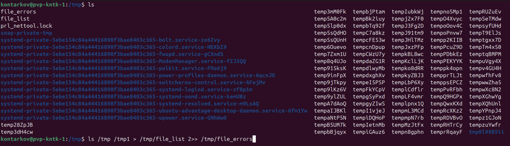
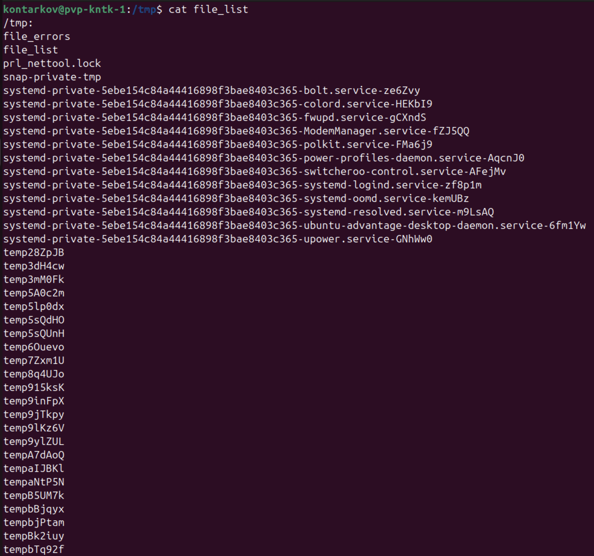
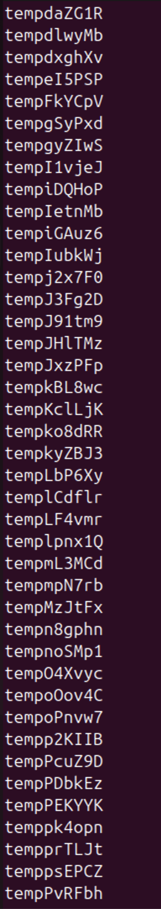
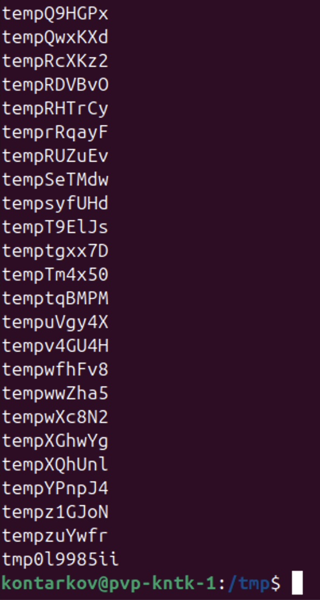
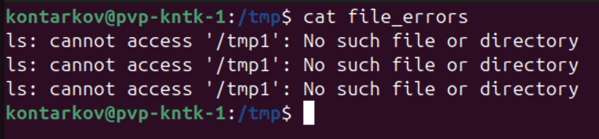

# Задание 1
### Измените команду `ls /tmp /tmp1` так, чтобы:

Результат работы (список файлов) для текущего запуска команды выводился в файл `/tmp/file_list`.  
Ошибки для каждого запуска добавлялись в файл `/tmp/file_errors`.  

__Примечание к заданию:__
Создавать `/tmp1` не требуется. Директория должна отсутствовать для генерации вывода `stderr`.
Задание необходимо выполнить одной командой.  
В качестве решения пришлите полученную команду и скриншот терминала с выводом содержимого созданных файлов.  

### Решение:
* Команда: `ls /tmp /tmp1 > /tmp/file_list 2>> /tmp/file_errors`.  
Команда вызывалась 3 раза.  

  

* Содержимое `file_list`:

  

  

  

* Содержимое `file_errors`:

 
