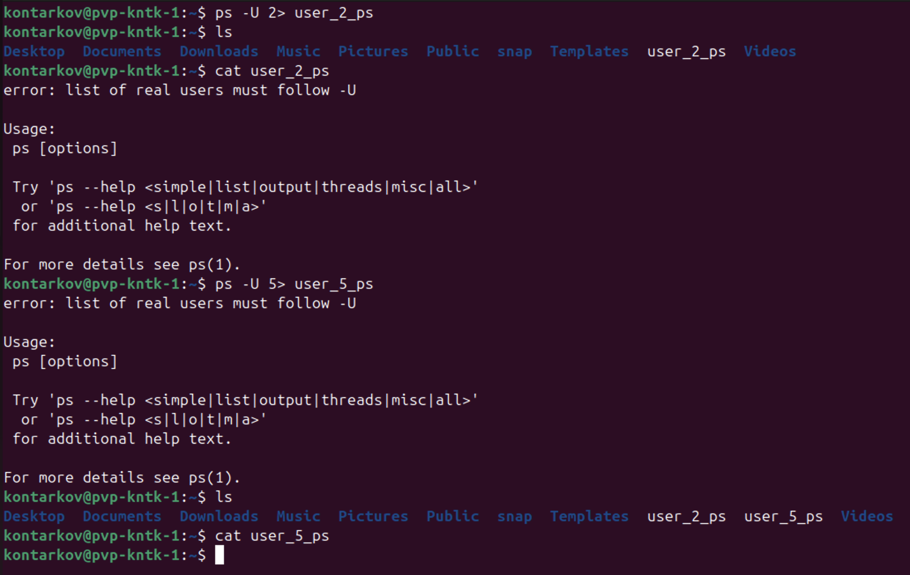
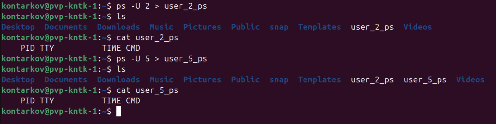

# Задание 3
### Начинающий администратор захотел вывести все запущенные процессы пользователя с логином "2" в файл "user_2_ps".

Для этого он набрал команду:  

`ps -U 2> user_2_ps`  
Затем, он аналогично повторил для пользователя с логином "5" вывод в файл "user_5_ps":

`ps -U 5> user_5_ps`  
_Вопрос:_  
_Почему вывод этих команд и содержимое файлов сильно отличаются друг от друга? Как должны выглядеть правильные команды?_  

__Примечание:__  
Если у вас в системе нет пользователей "2" и/или "5" (это нормальная ситуация), то утилита `ps` выводит только одну строку:  

` PID TTY          TIME CMD  `   
Ответ приведите в виде снимка экрана с комментариями в свободной форме.

### Решение:
Команда `ps -U 2> user_2_ps` выполнится с ошибкой отсутствия указания заданного пользователя и выведет эту ошибку выполнения в файл `user_2_ps`. Здесь `2>` интерпретируется как перенаправление потока ошибок. Поток ошибок перенаправляется в файл `user_2_ps`.   
Команда `ps -U 5> user_5_ps` выполнится с ошибкой отсутствия указания заданного пользователя и выведет эту ошибку на стандартный поток вывода (экран терминала), Здесь `5>` интерпретируется как перенаправление потока 5. Определены в системе только три потока: поток ввода - 0, поток вывода - 1, поток ошибок - 2. Так как потока 5 не существует, то файл `user_5_ps` сформируется пустым. 
Результаты выполнения команд:  

  

Правильные команды должны выглядеть, например, так:  
* `ps -U 2 > user_2_ps`  
* `ps -U 5 > user_5_ps`
 
или, например, так:  
* `ps -U 2 1> user_2_ps`  
* `ps -U 5 1> user_5_ps`
 
или, например, так:  
* `ps -U 2 1> user_2_ps 2> user_2_ps_errors`  
* `ps -U 5 1> user_5_ps 2> user_5_ps_errors` 

Так как пользователей "2" и "5" в системе не существует, то в результате выполнения правильных команд файлы `user_2_ps` и `user_5_ps` будут содержать строку:  
  
` PID TTY          TIME CMD  `  

Результаты выполнения команд:  

  
