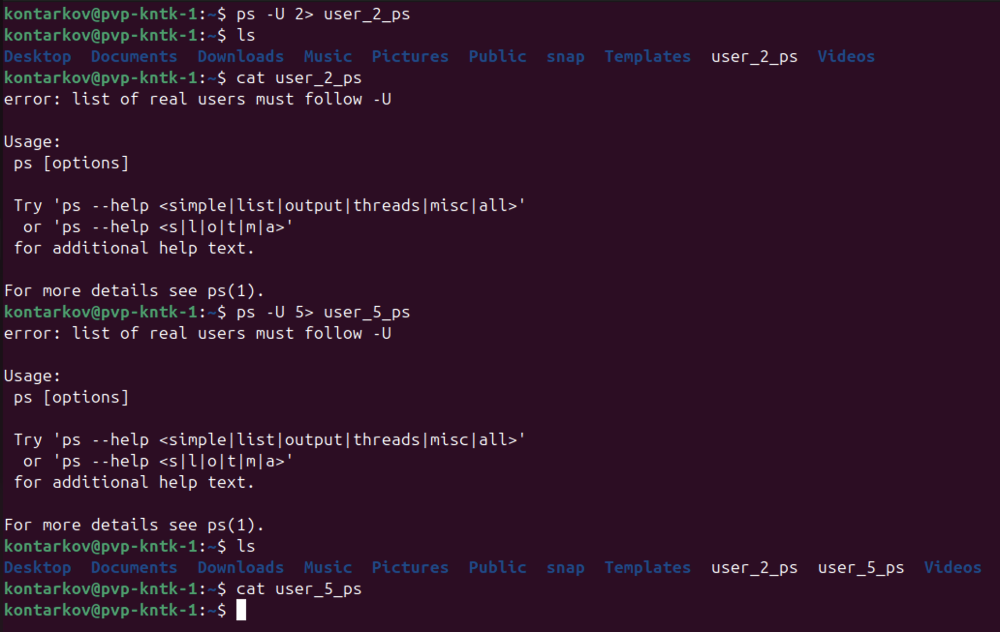
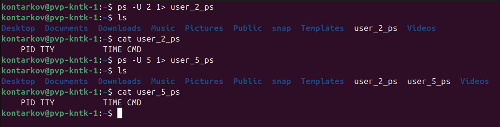

# DevOps • Операционная система Linux
## Процессы, управление процессами
__ШТЕНГЕЛОВ ИГОРЬ__

## Задание 1
### Измените команду `ls /tmp /tmp1` так, чтобы:

Результат работы (список файлов) для текущего запуска команды выводился в файл `/tmp/file_list`.  
Ошибки для каждого запуска добавлялись в файл `/tmp/file_errors`.  

__Примечание к заданию:__  
Создавать `/tmp1` не требуется. Директория должна отсутствовать для генерации вывода `stderr`.
Задание необходимо выполнить одной командой.  
В качестве решения пришлите полученную команду и скриншот терминала с выводом содержимого созданных файлов.  

## Решение 1:
* Команда: `ls /tmp /tmp1 > /tmp/file_list 2>> /tmp/file_errors`.  
Команда выполнялась 3 раза.  

  

* Содержимое `file_list`:

  

  

  

* Содержимое `file_errors`:

  

## Задание 2
### Напишите команду, которая выводит все запущенные процессы пользователя `root` в файл `user_root_ps`.  

## Решение 2:
Команда: `ps -U root > user_root_ps`  

## Задание 3
### Начинающий администратор захотел вывести все запущенные процессы пользователя с логином "2" в файл `user_2_ps`.

Для этого он набрал команду:  

`ps -U 2> user_2_ps`  
Затем, он аналогично повторил для пользователя с логином "5" вывод в файл `user_5_ps`:

`ps -U 5> user_5_ps`  
_Вопрос:_  
_Почему вывод этих команд и содержимое файлов сильно отличаются друг от друга? Как должны выглядеть правильные команды?_  

__Примечание:__  
Если у вас в системе нет пользователей "2" и/или "5" (это нормальная ситуация), то утилита `ps` выводит только одну строку:  

` PID TTY          TIME CMD  `   
Ответ приведите в виде снимка экрана с комментариями в свободной форме.

## Решение 3:
Команда `ps -U 2> user_2_ps` выполнится с ошибкой отсутствия указания заданного пользователя и выведет эту ошибку выполнения в файл `user_2_ps`. Здесь `2>` интерпретируется как перенаправление потока ошибок. Поток ошибок перенаправляется в файл `user_2_ps`.   
Команда `ps -U 5> user_5_ps` выполнится с ошибкой отсутствия указания заданного пользователя и выведет эту ошибку на стандартный поток вывода (экран терминала), Здесь `5>` интерпретируется как перенаправление потока `5`. Определены в системе только три потока: поток ввода - 0, поток вывода - 1, поток ошибок - 2. Так как потока 5 не существует, то файл `user_5_ps` сформируется пустым.  
__Результаты выполнения неправильных команд:__  

  

__Правильные команды__ должны выглядеть, например, так:  
* `ps -U 2 > user_2_ps`  
* `ps -U 5 > user_5_ps`
 
или, например, так:  
* `ps -U 2 1> user_2_ps`  
* `ps -U 5 1> user_5_ps`
 
или, например, так:  
* `ps -U 2 1> user_2_ps 2> user_2_ps_errors`  
* `ps -U 5 1> user_5_ps 2> user_5_ps_errors` 

Так как пользователей "2" и "5" в системе не существует, то в результате выполнения правильных команд файлы `user_2_ps` и `user_5_ps` будут содержать строку:  
  
` PID TTY          TIME CMD  `  

__Результаты выполнения правильных команд:__  

  

