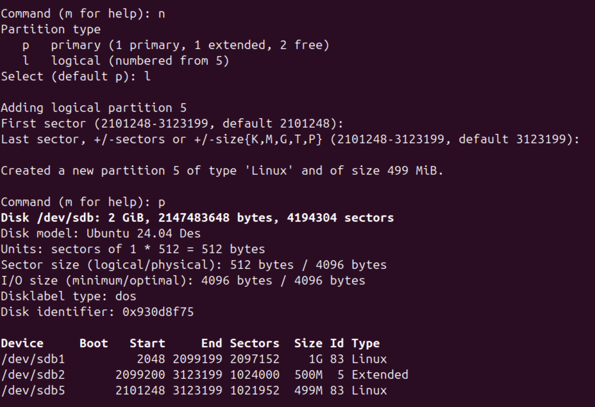

# DevOps • Операционная система Linux
## Дисковые системы
__ШТЕНГЕЛОВ ИГОРЬ__

## Задание 1
### Какие виды RAID увеличивают производительность дисковой системы? 
_Приведите ответ в свободной форме._ 

## Решение 1:

## Задание 2
### Назовите преимущества использования VFS. Используется ли VFS при работе с tmpfs? Почему? 
_Приведите развернутый ответ в свободной форме._ 

## Решение 2:

## Задание 3
### Подключите к виртуальной машине 2 новых диска.
### 1. На первом диске создайте таблицу разделов MBR, создайте 4 раздела: первый раздел на 50% диска, остальные диски любого размера на ваше усмотрение. Хотя бы один из разделов должен быть логическим.
### 2. На втором диске создайте таблицу разделов GPT. Создайте 4 раздела: первый раздел на 50% диска, остальные любого размера на ваше усмотрение.
_В качестве ответа приложите скриншоты, на которых будет видно разметку диска (например, командами `lsblk -a`; `fdisk -l`)_ 

## Решение 3:
* Смотрим список блочных устройств. Работаем с устройствами `sdb` и `sdc`. 
  
  
  
   
  
  
  

