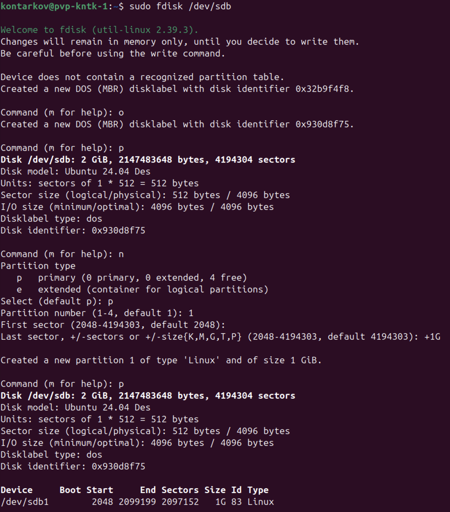
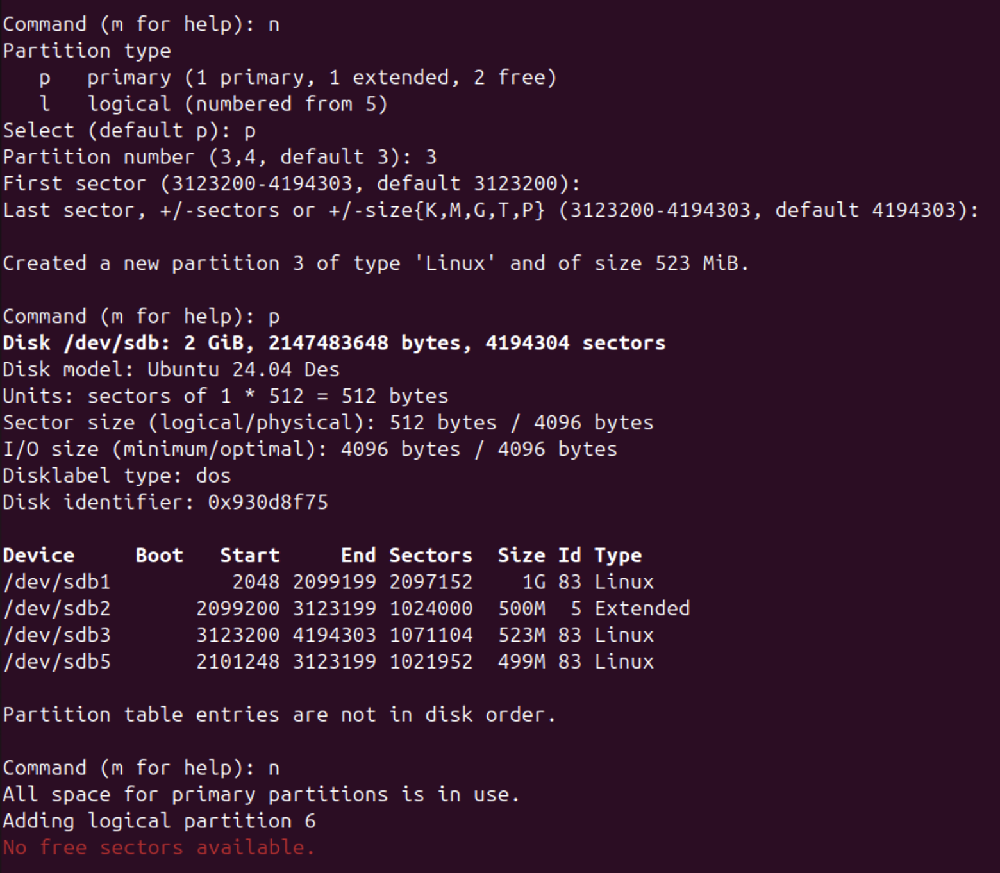
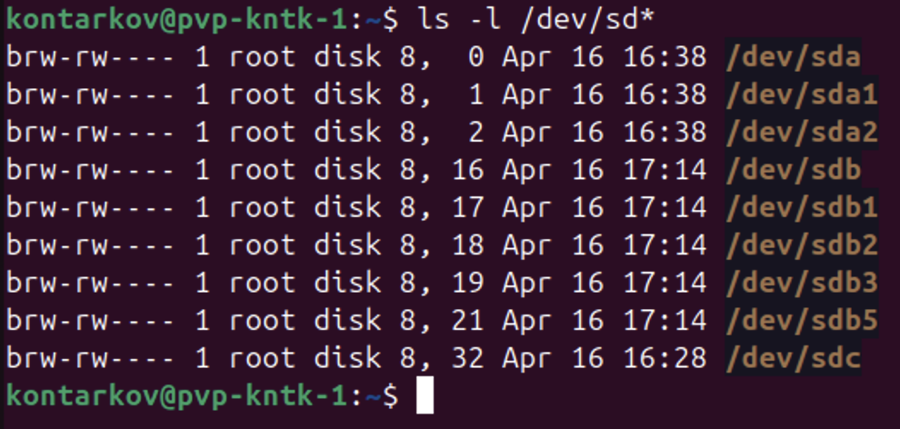

# DevOps • Операционная система Linux
## Дисковые системы
__ШТЕНГЕЛОВ ИГОРЬ__

## Задание 1
### Какие виды RAID увеличивают производительность дисковой системы? 
_Приведите ответ в свободной форме._ 

## Решение 1:

## Задание 2
### Назовите преимущества использования VFS. Используется ли VFS при работе с tmpfs? Почему? 
_Приведите развернутый ответ в свободной форме._ 

## Решение 2:
__Преимущества__
* Унификация доступа к файлам VFS  
  скрывает детали конкретной файловой системы.
* Расширяемость  
  можно легко добавлять поддержку новых типов файловых систем в ядро (через модули), не меняя остальной код системы.
* Поддержка сетевых и виртуальных файловых систем  
* Упрощение кэширования и буферизации  
  реализуются общие механизмы кэширования.

__VFS и tmpfs__  
VFS используется при работе с tmpfs. tmpfs — это полноценная файловая система, размещённая в оперативной памяти. VFS - это обязательный уровень для взаимодействия ядра ОС с любой файловой системой.
  
## Задание 3
### Подключите к виртуальной машине 2 новых диска.
### 1. На первом диске создайте таблицу разделов MBR, создайте 4 раздела: первый раздел на 50% диска, остальные диски любого размера на ваше усмотрение. Хотя бы один из разделов должен быть логическим.
### 2. На втором диске создайте таблицу разделов GPT. Создайте 4 раздела: первый раздел на 50% диска, остальные любого размера на ваше усмотрение.
_В качестве ответа приложите скриншоты, на которых будет видно разметку диска (например, командами `lsblk -a`; `fdisk -l`)_ 

## Решение 3:
* Выводим список блочных устройств компьютера. Работаем с дисками `sdb` и `sdc`.
  
  

__1. Дисковое устройство `sdb`__ 

* Убеждаемся в отсутствии разделов на устройстве `sdb`. Определяем объём доступного дискового пространства. Создаём таблицу разделов MBR и первый PRIMARY раздел объёмом 50% от объёма диска.
   
  

* Создаём EXTENDED раздел объёмом 500 Мб. 
  
  

* Создаём логический раздел в пределах секторов EXTENDED раздела. 
  
  

* Создаём второй PRIMARY раздел на весь неразмеченный объём диска. 
  
  
 
* Убеждаемся что диск размечен надлежащим образом и разметка диска сохранена. 
  
  
  

__2. Дисковое устройство `sdс`__ 

* Создаём таблицу разделов GPT и первый раздел с помощью утилиты `gdisk`. 

  
  

* Создаём разделы 2-4 с помощью утилиты `parted`. 

  
  
  
  

* Убеждаемся что диск размечен надлежащим образом и разметка диска сохранена. 

  
  

## Задание 4
### Создайте программный RAID 1 в вашей ОС, используя программу mdadm.
Объем RAID неважен.
_В качестве ответа приложите скриншот вывода команды `mdadm -D /dev/md0`, где `md0` - это название вашего рейд массива (может быть любым)._  

## Решение 4

* Создаём RAID 1 на основе `sdb` и `sdc`
  
  
  
  
  
  
