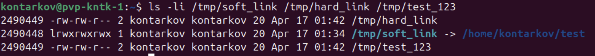

# DevOps • Операционная система Linux
## Файловые системы
__ШТЕНГЕЛОВ ИГОРЬ__

## Задание 1
__1. Создайте каталог `~/test` и в нём файл `test_123` с любым содержимым.__  
__2. Создайте символическую ссылку на каталог `~/test` по пути `/tmp/soft_link`.__   
__3. Используя ссылку `/tmp/soft_link`, скопируйте файл `test_123` в каталог `/tmp` с тем же именем. Создайте жёсткую ссылку на файл `/tmp/test_123` с именем `/tmp/hard_link`.__  

_Вопрос 1. Файл `~/test` и `/tmp/test_123` — это один и тот же файл (одинаковые inode)?_  

_Вопрос 2. Файл `/tmp/soft_link` и `/tmp/hard_link` — это один и тот же файл (одинаковые inode)?_  

_Вопрос 3. Файл `/tmp/test_123` и `/tmp/hard_link` — это один и тот же файл (одинаковые inode)?_  

_Вопрос 4. Докажите, что одна из ссылок символическая, а другая жёсткая. Обязательно приложите к ответу скриншоты команд, которые иллюстрируют различия ссылок разного типа, или, если не уверены, ход решения задания._  

## Решение 1:

  

   

  

_Вопрос 1._  
_Файл `~/test` и `/tmp/test_123`_  
Это два разных файла (разные inode).

_Вопрос 2._  
_Файл `/tmp/soft_link` и `/tmp/hard_link`_  
Это два разных файла (разные inode).  

_Вопрос 3._  
_Файл `/tmp/test_123` и `/tmp/hard_link`_  
Это один и тот же файл (один и тот же inode)

  

_Вопрос 4._  
Символическая ссылка (`/tmp/soft_link`) имеет префикс `l` в правах доступа и указывает на целевой путь.  
Жёсткая ссылка (`/tmp/hard_link`) и файл `/tmp/test_123` имеют одинаковый inode, но жёсткая ссылка имеет не `l`  , а обычное отображение прав доступа.  

  

## Задание 2
__1. Создайте файл `~/netology`.__  
__2. Создайте каталог `~/netology/`.__  
__3. Поместите файл `netology` в каталог `netology`.__  

_Какое или какие из трёх действий невозможно выполнить? Почему?_  

## Решение 2:

  
В указанной последовательности невозможно выполнить действие 2 и как следствие действие 3.
Происходит попытка создать каталог с таким же именем как и файл. Имена каталога и файла внутри одного каталога должны быть различные. Это обусловлено подходом к организации ФС.

## Задание 3
__1. Как посмотреть количество inodes?__  
__2. В каких файловых системах не может возникнуть проблемы нехватки inodes?__ 

_Запишите ответ в свободной форме._  

## Решение 3:

  
Не возникает проблемы нехватки inodes в виртуальных ФС, а также в ФС с динамическим распределением inodes, например: Btrfs, Xfs, Zfs

## Задание 4
Задание не предполагает использования LVM.

__1. Подключите к системе новый диск 3 Гб.__  
__2. Создайте на диске один раздел размером 2 Гб.__  
__3. Разметьте раздел как xfs.__  
__4. Смонтируйте раздел по пути /mnt. Создайте любой файл на смонтированной файловой системе. Сделайте скриншот вывода команды df -hT.__  
__5. Увеличьте раздел до 3 Гб.__  
__6. Расширьте файловую систему на новое свободное пространство.__  
__7. Убедитесь, что после всех манипуляций созданный вами файл остался внутри раздела и файловой системы.__  
__8. Сделайте скриншот вывода команды df -hT.__  

_В качестве ответа приложите два сделанных скриншота._  

## Решение 4:

  

  

