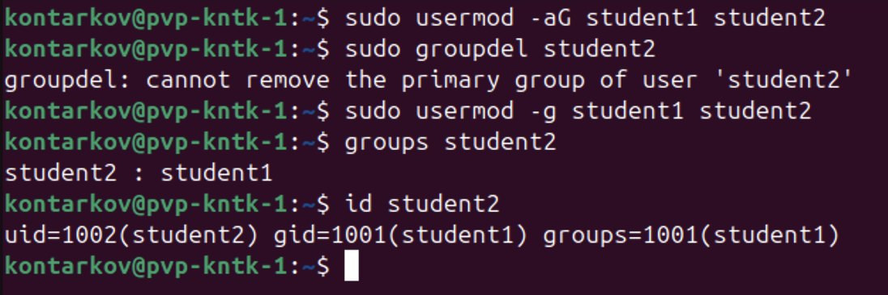
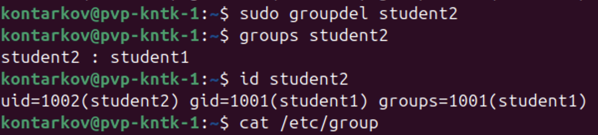

# DevOps • Администрирование ОС Linux
## Управление пользователями
__ШТЕНГЕЛОВ ИГОРЬ__  
  
## Задание 1.  
### Создайте пользователя student1 с оболочкой `bash`, входящего в группу student1.  
### Создайте пользователя student2, входящего в группу student2.  
_Приведите своё решение в виде снимков экрана._  

## Решение 1:  
  
  
  
  

## Задание 2.  
### Создайте в общем каталоге (например, /tmp) директорию и назначьте для неё полный доступ со стороны группы student2 и доступ на чтение всем остальным.
_Приведите своё решение в виде снимков экрана._  

### Решение 2:  

  
  
  

## Задание 3.  
### Какой режим доступа установлен для файлов `/etc/passwd` и `/etc/shadow`?
### Объясните, зачем понадобилось именно два файла.
_Приведите ответ в свободной форме._

### Решение 3:  

  

* `/etc/passwd`.
__Для владельца__ - режим "чтение-запись", __для группы__ - режим "чтение", __для всех остальных__ - режим "чтение".  
  
* `/etc/shadow`.
__Для владельца__ - режим "чтение-запись", __для группы__ - режим "чтение", __для всех остальных__ - нет доступа.

* __Зачем два файла?__  
Файлы `/etc/passwd` и `/etc/shadow` были разделены по соображениям безопасности и удобства администрирования.
Это помогает обеспечивать баланс между доступностью информации и безопасностью:  
 -- открыто предоставить информацию, необходимую для базовой работы с пользователями, в то время как сами пароли остаются защищенными;  
 -- даже если обычный пользователь может читать файл `/etc/passwd`, он не сможет получить доступ к зашифрованным паролям в файле `/etc/shadow`.

## Задание 4.
### Удалите группу student2, а пользователя student2 добавьте в группу student1.
_Приведите своё решение в виде снимков экрана._

## Решение 4:

  
  
  

## Задание 5.
### Напишите своими словами, как происходит сложение и вычитание прав доступа к файлам и папкам.
_Приведите ответ в свободной форме._  

## Решение 5:
Есть __типы прав доступа__: чтение, запись, выполнение. Их можно представить как число:  
r (чтение) = 4   
w (запись) = 2  
x (выполнение) = 1  

__Классы пользователей__:  
Владелец (user).  
Группа (group).  
Остальные пользователи (others).  
  
Например, права __755__ означают:  
Владелец: чтение, запись и выполнение (4 + 2 + 1 = 7)  
Группа: чтение и выполнение (4 + 1 = 5)  
Остальные: чтение и выполнение (4 + 1 = 5)  

__Сложение прав__: добавление прав Группы на запись приводит к увеличению соответствующего значения для Группы: 4 (+ 2) + 1. Права становятся __775__.  
__Вычитание прав__: удаление прав у Остальных на выполнение приводит к уменьшению соответствующего значения для Остальных: 4. Права становятся __754__.   

