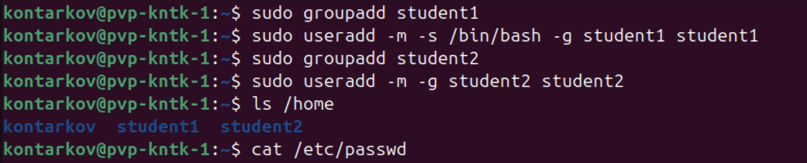
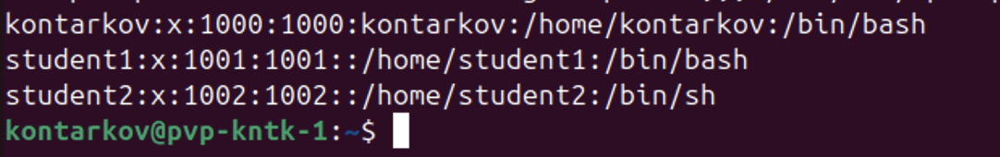
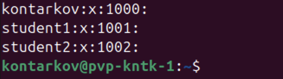
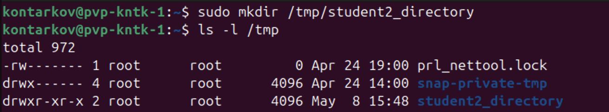
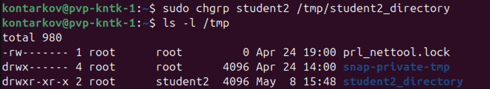
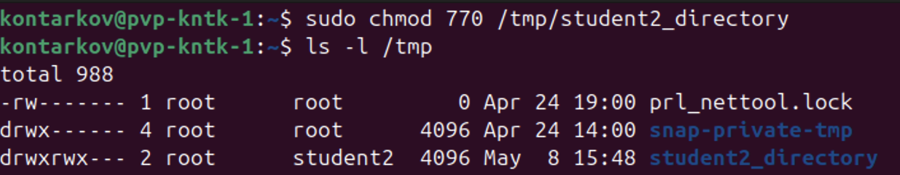
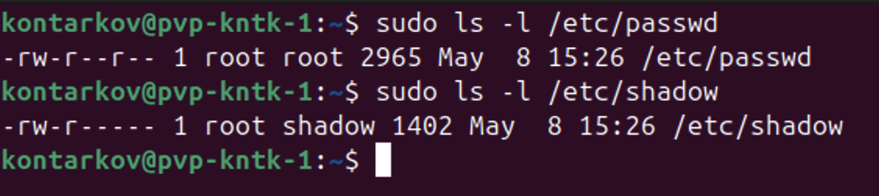

# DevOps • Администрирование ОС Linux
## Управление пользователями
__ШТЕНГЕЛОВ ИГОРЬ__  
  
## Задание 1:  
### Создайте пользователя student1 с оболочкой `bash`, входящего в группу student1.  
### Создайте пользователя student2, входящего в группу student2.  
_Приведите своё решение в виде снимков экрана._  

## Решение 1:  
  
  
  
  

## Задание 2:  
### Создайте в общем каталоге (например, /tmp) директорию и назначьте для неё полный доступ со стороны группы student2 и доступ на чтение всем остальным.
_Приведите своё решение в виде снимков экрана._  

### Решение 2:  

  
  
  

## Задание 3:  
### Какой режим доступа установлен для файлов `/etc/passwd` и `/etc/shadow`?
### Объясните, зачем понадобилось именно два файла.
_Приведите ответ в свободной форме._

### Решение 3:  

  

* `/etc/passwd`.
__Для владельца__ - режим "чтение-запись", __для группы__ - режим "чтение", __для всех остальных__ - режим "чтение".  
  
* `/etc/shadow`.
__Для владельца__ - режим "чтение-запись", __для группы__ - режим "чтение", __для всех остальных__ - нет доступа.  
