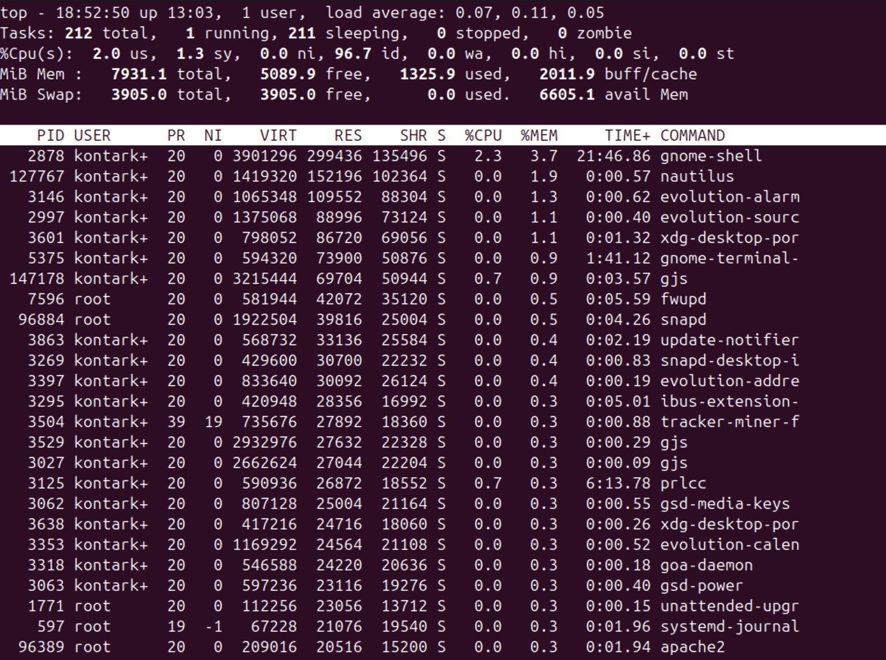
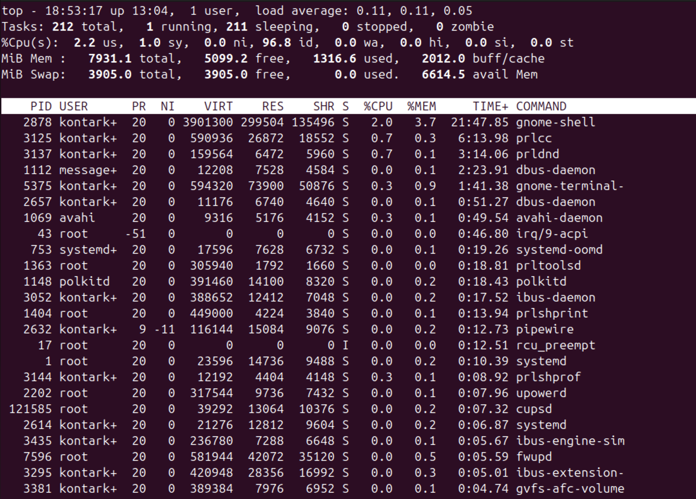
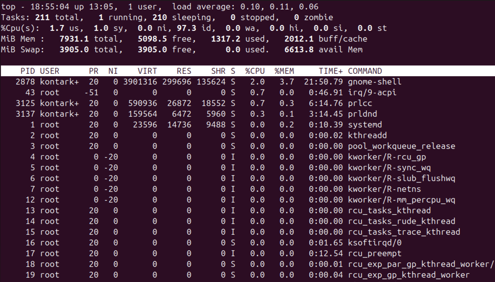
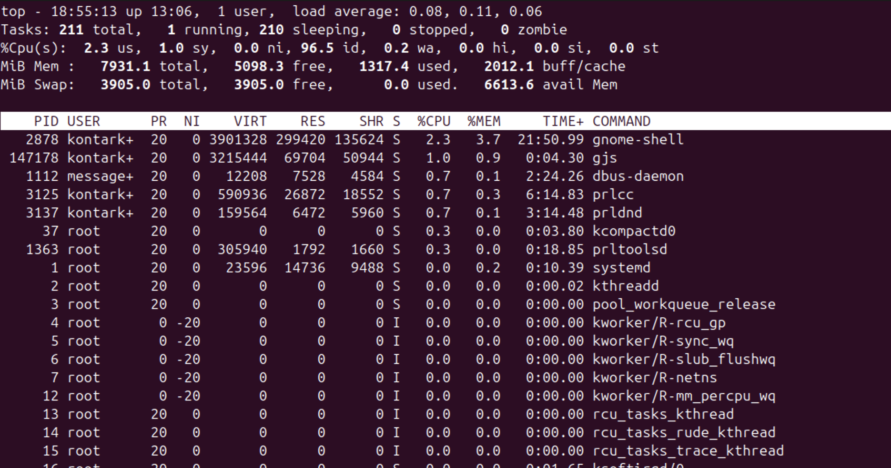
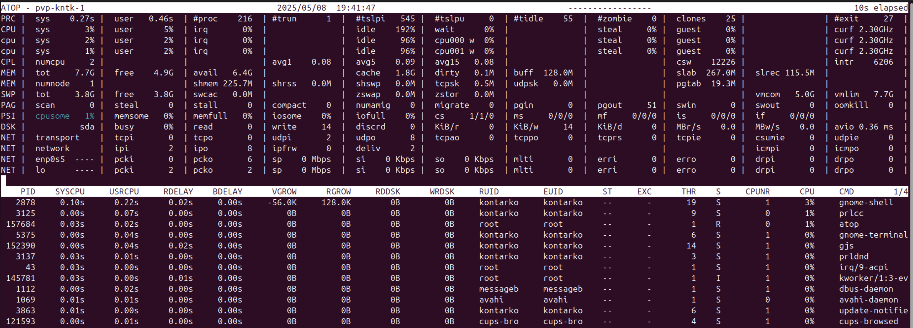
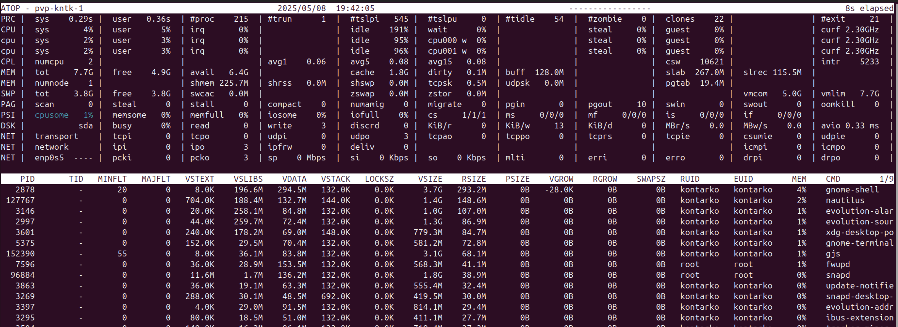
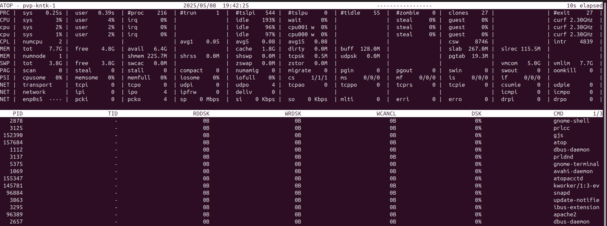
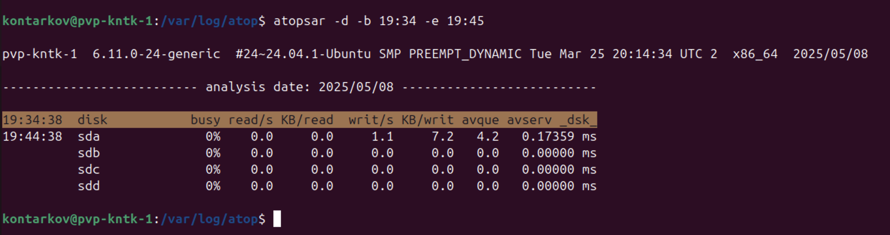
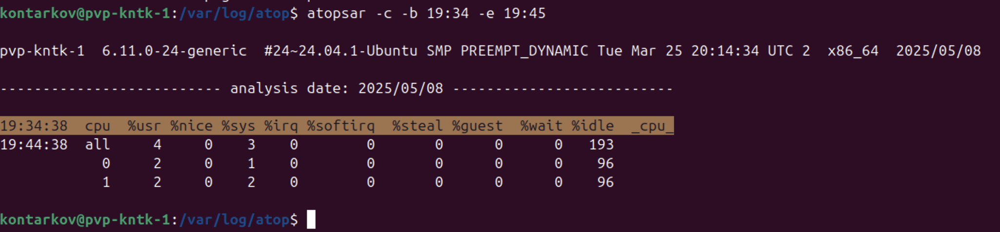

# DevOps • Администрирование ОС Linux
## Производительность системы I
__ШТЕНГЕЛОВ ИГОРЬ__  
  
## Задание 1.
## Выполните проверку системы при помощи команды `top`.
Выведите сортировку процессов по:  
-- памяти,  
-- времени работы,  
-- номеру,  
-- уровню потребления ресурсов.  
_Приведите ответ в виде снимков экрана._  

## Решение 1:  
* __`top`__
  
  

* __Сортировка по памяти__
  

* __Сортировка по времени работы__
  

* __Сортировка по номеру процесса__
  

* __Сортировка по уровню потребления ресурсов__
  
  

## Задание 2.
### Выполните проверку системы при помощи команды atop и atopsar.
### Выведите сортировку процессов по:
### общей нагрузке — минимум по трём параметрам;
### загруженности HDD or SSD за указанный временной отрезок — 10 минут;
### загруженности RAM за указанный временной отрезок — 10 минут.
### Сконфигурировать файл настроек atop — делать снимок памяти каждые полчаса.
_Приведите ответ в виде снимков экрана._  

## Решение 2:

  
  
  
  
  
  
  

