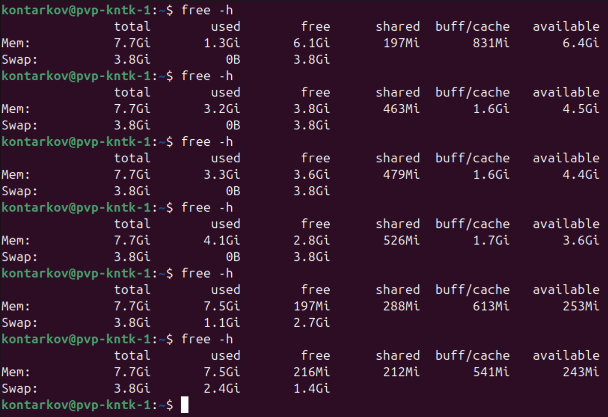

# DevOps • Администрирование ОС Linux
## Производительность системы II
__ШТЕНГЕЛОВ ИГОРЬ__  
  
## Задание 1.
### Составьте задание через утилиту `cron` на проверку объёма кеш-обновлений еженедельно.
Кеш-обновления — это обновления, которые остаются после выполнения apt update, apt upgrade.  
_Приведите ответ в виде команды._  

## Решение 1:  

* __`crontab -e`__  
Каждую среду в 5:00 утра вычисляется объём кеша обновлений и результат отправляется на указанный адрес электронной почты с темой "Объём кеша обновлений".

  

## Задание 2.
### Запустите процесс копирования большого файла (1 Гб) на жёсткий диск.
### Запустите команду `iostat`.
### Запустите `iotop`.
### Какие процессы влияют на данные команды?
_Приведите развёрнутый ответ и приложите снимки экрана._

## Решение 2:  

* __Выбираем файл для копирования:__

  

* __Осуществляем копирование:__

  

* __Осуществляем мониторинг `iostat`:__

  

* __Осуществляем мониторинг `iostat -xz 1`:__

  
  
  

* __Осуществляем мониторинг `sudo iotop`:__

  
  
  
  

* __Влияющие процессы:__

__`iostat`__  

  Основной диск `sda` активно работает, выполняя операции записи с довольно высокой интенсивностью. Например, на данный момент устройство записывает 386,304 кБ в секунду и выполняет 332 операции записи в секунду.  
  Процессор использует около 7-8% времени на пользовательские процессы (столбцы `%user`), и 66-63% времени процессор находится в ожидании ввода/вывода (`%iowait`), что может указывать на то, что диск не успевает справляться с нагрузкой.
В целом, диск активно используется, и если проценты использования процессора для ожидания ввода/вывода (`iowait`) высоки, это может означать, что операции ввода/вывода на диске занимают много времени, что может замедлять работу системы.

__`iotop`__  
1. __Основной процесс копирования (`cp`)__ оказывает наибольшее влияние на систему, так как он записывает 5.24 ГБ данных.  
2. __Процесс `jbd2`__ управляет журналированием данных, что важно для безопасности файловой системы, но сам по себе не оказывает значительного влияния на производительность. 
 3. __Процесс `gnome-terminal-server`__ выполняет чтение с диска (20 КБ), что может быть связано с открытием терминала или загрузкой конфигураций. Но это является минимальной нагрузкой на систему.  
4. __Фоновые процессы `kworker`__ выполняют задачи обслуживания системы и могут влиять на производительность, но обычно их влияние меньше по сравнению с активными процессами ввода/вывода, такими как копирование файлов.  

## Задание 3.
### Настройте приоритет использования swap в пропорции:
-- 30/70,  
-- 50/50,  
-- 70/30.  
### Запустите браузер и нагрузите память:
-- сделайте скриншот терминала с выводом команды free -h;  
-- открывайте закладки браузера, к примеру, Rutube;  
-- мониторьте использование swap командой free -h;  
-- при увеличении swap сделайте скриншот free -h;  
-- продолжайте открывать закладки до близкого к полному исчерпанию оперативной памяти;  
-- сделайте скриншот free -h;  
-- сбросьте swap или перезагрузите машину;  
-- повторите всё сначала в следующем режиме.  
### Проанализируйте результат.  
_Приведите развёрнутый ответ и приложите снимки экрана._  

## Решение 3:  

* __Приоритет `swap` 30/70__

  

_Открываем всё больше и больше ресурсоёмких страниц в веб-браузере._  
_Мониторинг памяти по `free -h`._  
  
  
  
  

_АНАЛИЗ_  
_Вначале:_  
`Mem`: Используется около 7.3 ГБ из 7.7 ГБ. Это близко к максимальному объёму оперативной памяти.  
`Swap`: Используется 1.3 ГБ, что указывает на то, что система начала активно использовать swap, но ещё не полностью его заняла.  
_Далее:_  
Постепенное увеличение `used` в столбце `Mem` показывает, что оперативная память практически заполнилась.  
Значительное увеличение использования `Swap` (например, 2.7 ГБ) показывает, что система использует swap более активно.  
После использования swap, доступная память сильно снижается (например, до 456 МБ).  
На ранних этапах работы системы swap практически не используется, пока не начинается интенсивное использование оперативной памяти.
  
* __Приоритет `swap` 50/50__  

  

_Открываем всё больше и больше ресурсоёмких страниц в веб-браузере._  
_Мониторинг памяти по `free -h`._  
  
  
  
  

* __Приоритет `swap` 70/30__

  
