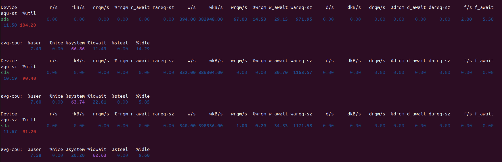

# DevOps • Администрирование ОС Linux
## Производительность системы II
__ШТЕНГЕЛОВ ИГОРЬ__  
  
## Задание 1.
### Составьте задание через утилиту `cron` на проверку объёма кеш-обновлений еженедельно.
Кеш-обновления — это обновления, которые остаются после выполнения apt update, apt upgrade.  
_Приведите ответ в виде команды._  

## Решение 1:  

* __`crontab -e`__  
Каждую среду в 5:00 утра вычисляется объём кеша обновлений и результат отправляется на указанный адрес электронной почты с темой "Объём кеша обновлений".

  

## Задание 2.
### Запустите процесс копирования большого файла (1 Гб) на жёсткий диск.
### Запустите команду `iostat`.
### Запустите `iotop`.
### Какие процессы влияют на данные команды?
_Приведите развёрнутый ответ и приложите снимки экрана._

## Решение 2:  

* __Выбираем файл для копирования:__

  

* __Осуществляем копирование:__

  

* __Осуществляем мониторинг `iostat`:__

  

* __Осуществляем мониторинг `iostat -xz 1`:__

  
  
  

* __Осуществляем мониторинг `sudo iotop`:__

  
  
  
  

* __Влияющие процессы:__

1. __Основной процесс копирования (`cp`)__ является тем, который оказывает наибольшее влияние на систему, так как он записывает 5.24 ГБ данных.  
2. __Процесс `jbd2`__ управляет журналированием данных, что важно для безопасности файловой системы, но сам по себе не оказывает значительного влияния на производительность.  
3. __Фоновые процессы `kworker`__ выполняют задачи обслуживания системы и могут влиять на производительность, но обычно их влияние меньше по сравнению с активными процессами ввода/вывода, такими как копирование файлов.  

## Задание 3.
### Настройте приоритет использования swap в пропорции:
-- 30/70,  
-- 50/50,  
-- 70/30.  
### Запустите браузер и нагрузите память:
-- сделайте скриншот терминала с выводом команды free -h;  
-- открывайте закладки браузера, к примеру, Rutube;  
-- мониторьте использование swap командой free -h;  
-- при увеличении swap сделайте скриншот free -h;  
-- продолжайте открывать закладки до близкого к полному исчерпанию оперативной памяти;  
-- сделайте скриншот free -h;  
-- сбросьте swap или перезагрузите машину;  
-- повторите всё сначала в следующем режиме.  
### Проанализируйте результат.  
_Приведите развёрнутый ответ и приложите снимки экрана._  

## Решение 3:  

_NB! РЕШЕНИЕ БУДЕТ ВЫЛОЖЕНО 9 МАЯ. НАХОЖУСЬ В ПОЕЗДКЕ_  
