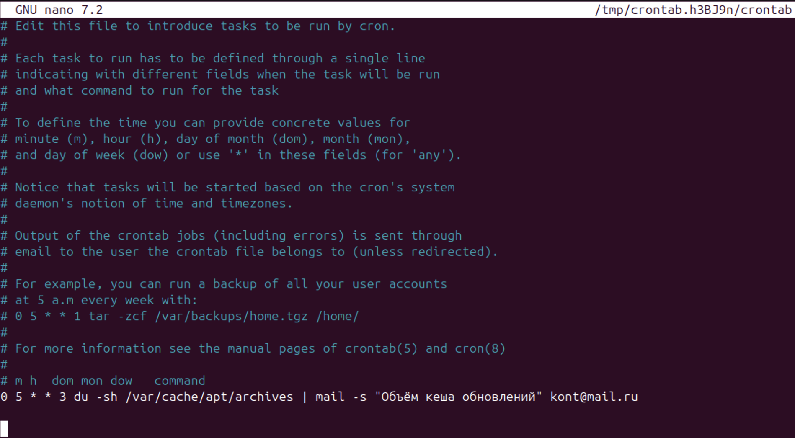

# DevOps • Администрирование ОС Linux
## Производительность системы II
__ШТЕНГЕЛОВ ИГОРЬ__  
  
## Задание 1.
### Составьте задание через утилиту cron на проверку объёма кеш-обновлений еженедельно.
Кеш-обновления — это обновления, которые остаются после выполнения apt update, apt upgrade.  
_Приведите ответ в виде команды._  

## Решение 1:  

* __`crontab -e`__
Каждую среду в 5:00 утра вычисляется объём кэша обновлений и результат отправляется на указанный адрес электронной почты с темой "Объём кэша обновлений".

 
