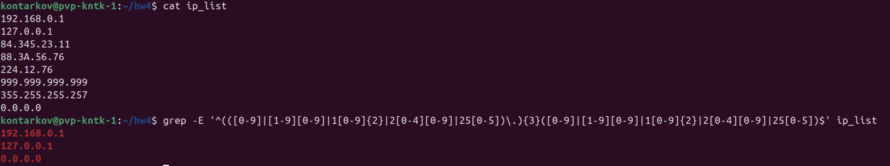
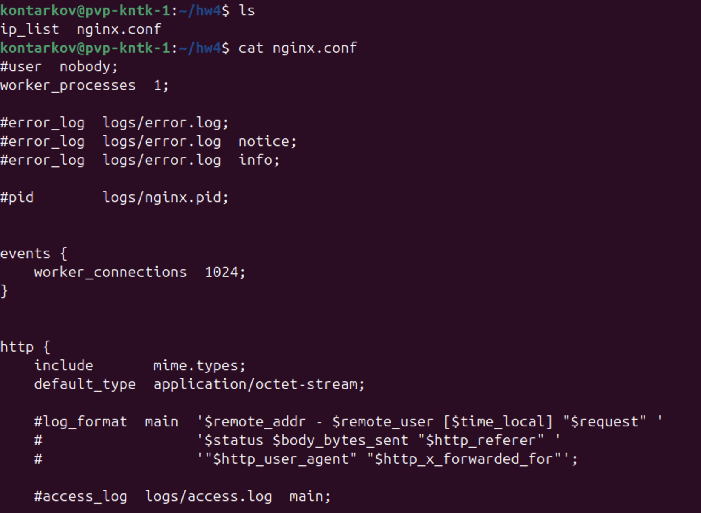
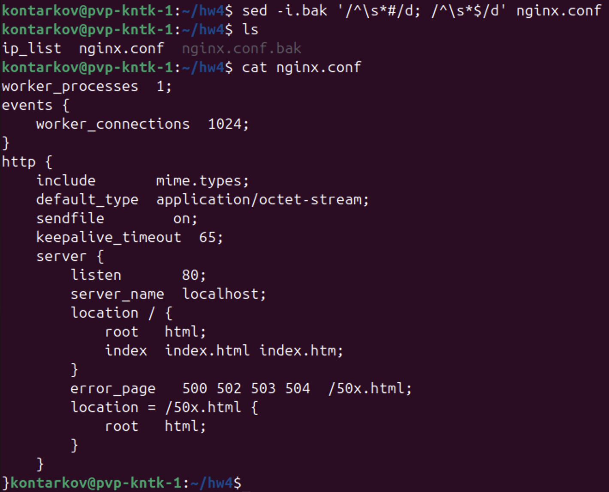

# DevOps • Программирование на Bash
## Regexp и его использование для синтаксического анализа
__ШТЕНГЕЛОВ ИГОРЬ__

## Задание 1
Напишите регулярное выражение для проверки является ли строка IPv4 адресом.  
Для тестов можно использовать файл со следующим содержимым, фильтруя вывод с помощью команды `grep -E`:  
  
192.168.0.1  
127.0.0.1  
84.345.23.11  
88.3A.56.76  
224.12.76  
999.999.999.999  
355.255.255.257  
0.0.0.0  

_Пришлите получившееся выражение в качестве ответа._  

## Решение 1:
* Выводим только строки с IPv4 адресами
  
  

## Задание 2
В Вашей конфигурации `Nginx` скопилось много неиспользуемых сегментов и становится сложно его читать.  
Используя `sed` удалите все пустые строки и комментарии в конфигурации `Nginx`.  
Попробуйте сделать это одним запуском.  
Файл расположен по [ссылке](./nginx.conf)  
_Пришлите получившуюся команду в качестве ответа._  

## Решение 2  

  

* Команда `sed` редактирования файла конфигурации с  созданием архива предыдущй версии файла:  

  

## Задание 3
Используя `awk` и `ps aux` соберите информацию о:  
-- количестве процессов для каждого пользователя;  
-- процессе с самым большим `PID`;  
-- (дополнительное задание со звездочкой*) суммарном использовании памяти различными пользователями.  
_Пришлите скриншоты со скриптами и демонстрацией их работы._  

## Решение 3

* КОЛИЧЕСТВО ПРОЦЕССОВ ДЛЯ КАЖДОГО ПОЛЬЗОВАТЕЛЯ:
  -- выводим список всех процессов
  -- пропускаем заголовок
  -- берём поле с именем пользователя  
  -— увеличиваем счётчик процессов для каждого пользователя
  —- после обработки всех строк печатаем статистику
  
* ПРОЦЕСС С САМЫМ БОЛЬШИМ `PID`:
  —- берём поле `PID`
  -— проверяем, больше ли текущий `PID`, чем предыдущий максимум
  -— сохраняем всю строку  
  -- печатаем строку процесса с максимальным `PID`  

* СУММАРНОЕ ИСПОЛЬЗОВАНИЕ ПАМЯТИ РАЗЛИЧНЫМИ ПОЛЬЗОВАТЕЛЯМИ:
  -— выводим все процессы
  -— суммируем использование памяти для каждого пользователя
  -— выводим имя пользователя и сумму потребляемой памяти с двумя знаками после запятой
  -— сортирует по значению используемой памияти в обратном порядке  

