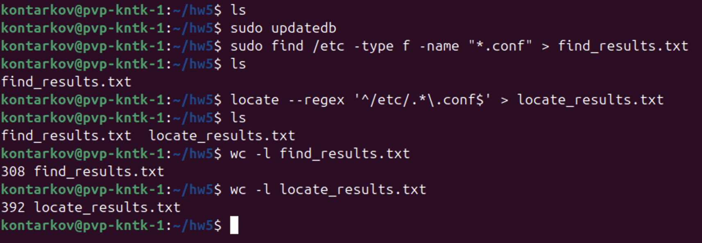
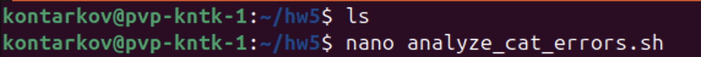
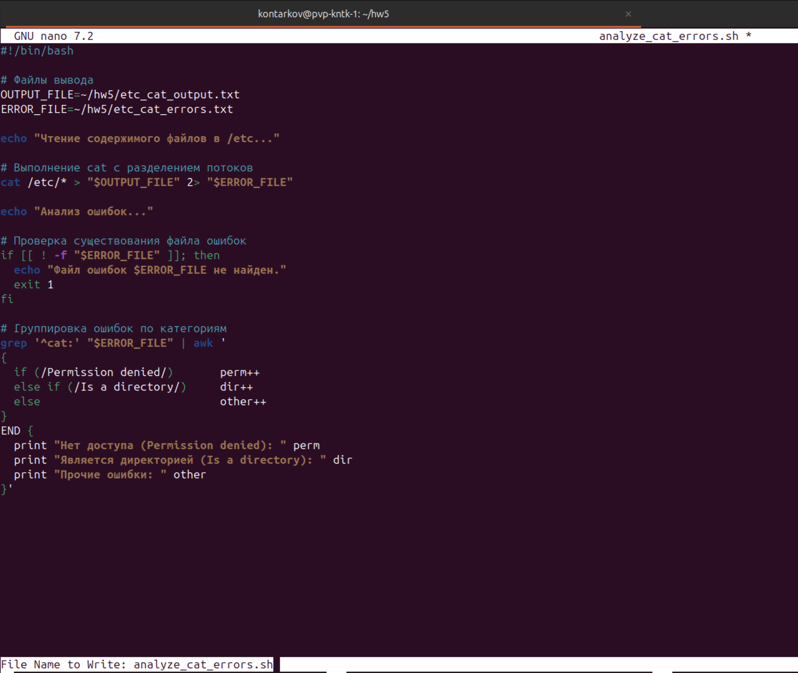
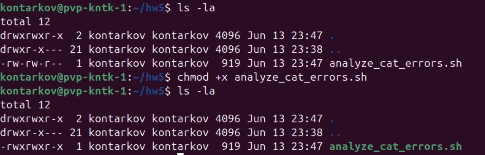
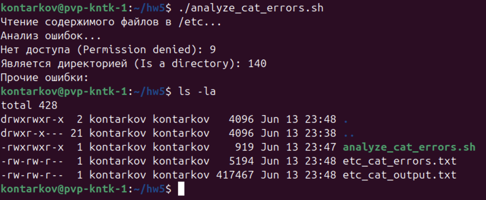
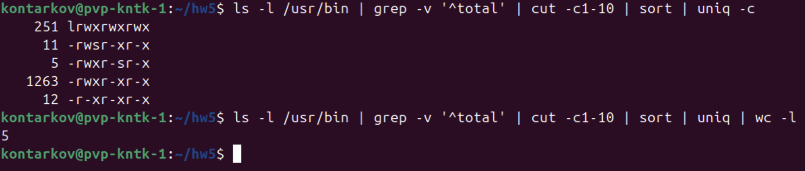

# DevOps • Программирование на Bash
## Работа с текстовыми утилитами
__ШТЕНГЕЛОВ ИГОРЬ__

## Задание 1
-- Найдите все файлы с расширением `.conf` в `/etc` сначала с помощью команды `find`, а потом с помощью команды `locate`;  
-- Перенаправьте результаты работы каждой команды в разные файлы;  
-- Подсчитайте количество найденных файлов в каждом случае с помощью `wc`.  

## Решение 1  
  

## Задание 2  
-- Выведите с помощью `cat` содержимое всех файлов в директории `/etc` `cat /etc/*`;  
-- Направьте ошибки в отдельный файл в вашей домашней директории;  
-- Стандартный поток вывода направьте в другой файл;  
-- Подсчитайте, сколько объектов не удалось прочитать.  

## Решение 2  
* Создадим файл со скриптом `analyze_cat_errors.sh`, в котором будем выполнять команды и анализ файла с потоком ошибок.  
  
  
  
  

## Задание 3  
-- Перенаправьте результат работы команды `ls -l` в каталоге с большим количеством файлов в утилиту `cut`, чтобы отобразить только права доступа к файлам;  
-- Отправьте в конвейере этот вывод на `sort` и `uniq`, чтобы отфильтровать все повторяющиеся строки;  
-- Уберите из подсчета строку `total`;  
-- С помощью `wc` подсчитайте различные типы разрешений в этом каталоге.  

## Решение 3  
  
