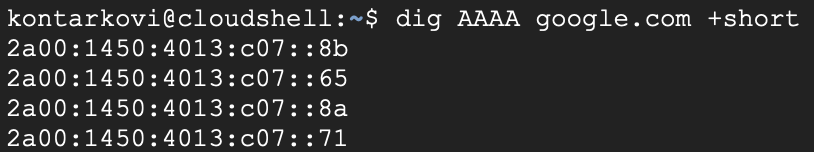

# DevOps • Сеть, сетевые протоколы
## Сеть, сетевые протоколы: IPv6
__ШТЕНГЕЛОВ ИГОРЬ__

## Задание 1
Какая нотация используется для записи IPv6-адресов:  
-- какие и сколько символов?  
-- какие разделители?   

## Решение 1  
Для записи IPv6-адреса используется шестнадцатеричная нотация: цифры от `0` до `9` и буквы от `a` до `f`.  
Адрес состоит из восьми групп по четыре шестнадцатеричных символа. Группы разделяются двоеточиями `:`.  
Ведущие нули в каждой группе разрешается не записывать.  
Например:  
`2001:0db8:0000:0000:0000:ff00:0042:8329`  
После удаления ведущих нулей:  
`2001:db8:0:0:0:ff00:42:8329`  

## Задание 2  
-- Какой адрес используется в IPv6 как `loopback`?  

## Решение 2  
* В IPv6 в качестве `loopback` используется адрес `::1`. Он соответствует IPv4-адресу `127.0.0.1` и указывает на текущий компьютер.  
  
## Задание 3  
-- Что такое `Unicast`, `Multicast`, `Anycast` адреса?  

## Решение 3  
`Unicast` — передача пакета одному конкретному сетевому интерфейсу.  
`Multicast` — передача пакета группе сетевых узлов, входящих в определённую multicast-группу.  
`Anycast` — передача пакета одному из нескольких сетевых узлов с одинаковым адресом по наилучшему маршруту.  

## Задание 4  
-- Используя любую консольную утилиту в Linux, получите IPv6-адрес для какого либо ресурса.  
  
## Решение 4  
С помощью консольной утилиты `dig` получим IPv6-адреса ресурса `google.com`. Для запроса DNS-записей типа `AAAA` используем команду:  
`dig AAAA google.com +short`  
В результате получаем IPv6-адреса, представленные на скриншоте:  

  

## Задание 5  
-- Как выглядят IPv6-адреса, которые маршрутизируются в интернете?  
-- Как выглядят локальные IPv6 адреса?  
  
## Решение 5  
`2000::/3`  — диапазон глобальных Unicast-адресов, маршрутизируемых в интернете. Такие адреса обычно начинаются с `2` или `3`.
`fe80::/10` — Link-local-адреса, действующие только в пределах одного сетевого сегмента и не маршрутизируемые через интернет.
`fc00::/7`  — Unique Local Addresses для частных сетей. На практике локально создаваемые адреса обычно начинаются с `fd`.  
