# Домашнее задание «Типы виртуализаций KVM, QEMU»

## Оглавление

- [Исходный стенд](#исходный-стенд)
- [Задание 1 - QEMU без аппаратного ускорения](#задание-1---qemu-без-аппаратного-ускорения)
  - [1. Проверка QEMU и virt-install](#1-проверка-qemu-и-virt-install)
  - [2. Подготовка установочного образа Alpine Linux](#2-подготовка-установочного-образа-alpine-linux)
  - [3. Создание виртуальной машины QEMU](#3-создание-виртуальной-машины-qemu)
  - [4. Загрузка Alpine через последовательную консоль](#4-загрузка-alpine-через-последовательную-консоль)
  - [5. Установка Alpine на виртуальный диск](#5-установка-alpine-на-виртуальный-диск)
  - [6. Проверка загрузки установленной системы](#6-проверка-загрузки-установленной-системы)
  - [7. Финальная проверка корневой файловой системы](#7-финальная-проверка-корневой-файловой-системы)
  - [Результат задания 1](#результат-задания-1)
- [Задание 2 - KVM и libvirt](#задание-2---kvm-и-libvirt)
  - [1. Проверка аппаратной виртуализации и KVM](#1-проверка-аппаратной-виртуализации-и-kvm)
  - [2. Создание виртуальной машины KVM](#2-создание-виртуальной-машины-kvm)
  - [3. Загрузка установочной среды через KVM](#3-загрузка-установочной-среды-через-kvm)
  - [4. Установка Alpine на виртуальный диск](#4-установка-alpine-на-виртуальный-диск-1)
  - [5. Проверка загрузки установленной системы](#5-проверка-загрузки-установленной-системы)
  - [Результат задания 2](#результат-задания-2)
- [Задание 3 - сравнение QEMU и KVM](#задание-3---сравнение-qemu-и-kvm)
  - [Метод сравнения](#метод-сравнения)
  - [1. Время запуска QEMU](#1-время-запуска-qemu)
  - [2. Время запуска KVM](#2-время-запуска-kvm)
  - [3. Сравнение результатов](#3-сравнение-результатов)
  - [Результат задания 3](#результат-задания-3)

---

## Исходный стенд

Работа выполнена в лабораторном контуре:

- Intel Mac -> Parallels Desktop Pro -> Ubuntu Server 24.04.4 LTS x86-64;
- в Ubuntu доступна вложенная аппаратная виртуализация Intel VT-x (`vmx`) и устройство `/dev/kvm`;
- для управления виртуальными машинами используются libvirt, `virt-install` и `virsh`;
- гостевая ОС для заданий 1 и 2 - Alpine Linux 3.13.

---

# Задание 1 - QEMU без аппаратного ускорения

## Цель

Установить QEMU, создать виртуальную машину и установить в неё гостевую ОС Alpine Linux. При создании виртуальной машины через `virt-install` используется параметр:

```bash
--virt-type qemu
```

Это обеспечивает запуск виртуальной машины в режиме QEMU без KVM-ускорения.

## 1. Проверка QEMU и virt-install

После установки пакетов выполнена проверка версий:

```bash
qemu-system-x86_64 --version
virt-install --version
```

Получено:

- QEMU 8.2.2;
- `virt-install` 4.1.0.

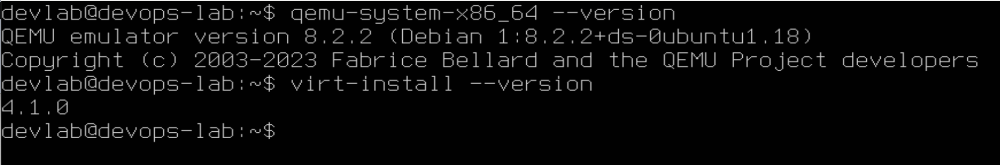

## 2. Подготовка установочного образа Alpine Linux

Установочный ISO Alpine Linux 3.13 подключён к Ubuntu как `/dev/sr0`. Для определения имён ядра и initramfs образ смонтирован только для чтения:

```bash
sudo mkdir -p /mnt/alpine-iso
sudo mount -o ro /dev/sr0 /mnt/alpine-iso
ls -lh /mnt/alpine-iso/boot
```

В каталоге `boot` обнаружены `vmlinuz-lts`, `initramfs-lts` и `modloop-lts`.

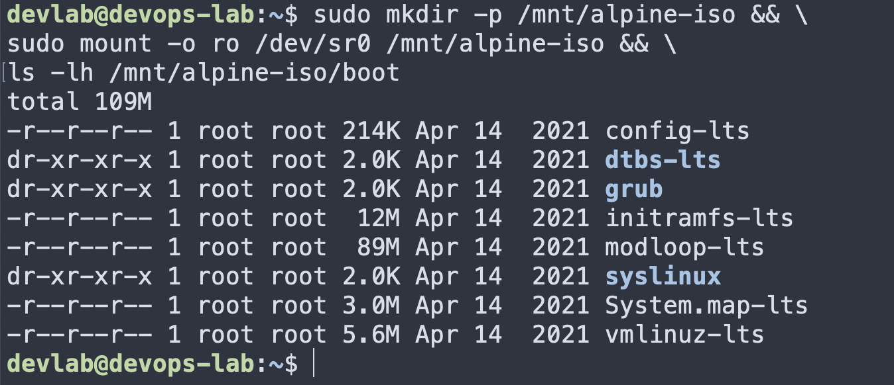

## 3. Создание виртуальной машины QEMU

Команда `virt-install` оформлена в скрипт `virt-install-alpine-qemu.sh`:

```bash
#!/bin/bash

sudo virt-install \
  --name alpine-qemu \
  --memory 1024 \
  --vcpus 1 \
  --disk size=4,bus=virtio \
  --disk path=/dev/sr0,device=cdrom,readonly=on \
  --location /mnt/alpine-iso,kernel=boot/vmlinuz-lts,initrd=boot/initramfs-lts \
  --extra-args "console=ttyS0,115200" \
  --os-variant alpinelinux3.13 \
  --virt-type qemu \
  --graphics none \
  --console pty,target_type=serial
```

Основные параметры:

- `--virt-type qemu` - запуск без KVM-ускорения;
- `--memory 1024` - 1 ГБ RAM;
- `--vcpus 1` - один виртуальный CPU;
- `--disk size=4,bus=virtio` - виртуальный диск 4 ГБ;
- `--disk path=/dev/sr0,device=cdrom,readonly=on` - подключение ISO как CD-ROM;
- `console=ttyS0,115200` - вывод гостевой консоли в последовательный терминал;
- `--graphics none` и `--console pty,target_type=serial` - работа без графической консоли через serial console.

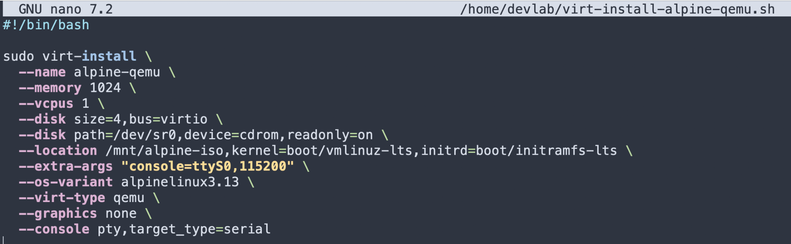

## 4. Загрузка Alpine через последовательную консоль

После запуска скрипта Alpine успешно загрузилась через `/dev/ttyS0`:

```text
Welcome to Alpine Linux 3.13
Kernel 5.10.29-0-lts on an i686 (/dev/ttyS0)

localhost login:
```


После входа под `root` запущен штатный установщик:

```bash
setup-alpine
```

В мастере установки выбраны сеть по DHCP, OpenSSH, виртуальный диск `vda` и режим установки `sys`.

## 5. Установка Alpine на виртуальный диск

После подтверждения очистки виртуального диска установщик создал файловые системы и установил Alpine на `vda`:

```text
Installing system on /dev/vda3
...
Installation is complete. Please reboot.
```

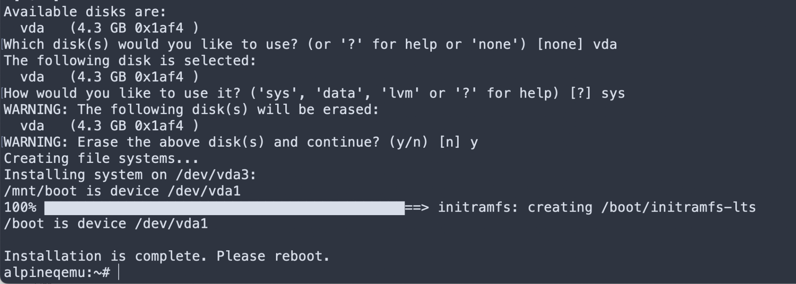

## 6. Проверка загрузки установленной системы

После завершения установки VM была перезапущена с загрузкой с виртуального диска. Для запуска существующей VM с подключением к serial console использована команда:

```bash
sudo virsh start alpine-qemu --console
```

Загрузилась установленная система:

```text
Welcome to Alpine Linux 3.13
Kernel 5.10.152-0-lts on an i686 (/dev/ttyS0)

alpineqemu login:
```

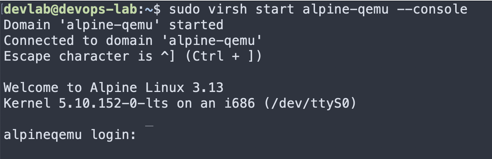

## 7. Финальная проверка корневой файловой системы

```bash
mount | grep ' on / '
```

Результат:

```text
/dev/vda3 on / type ext4 (rw,relatime)
```

Это подтверждает, что Alpine работает с виртуального диска `vda`, а не из live ISO.

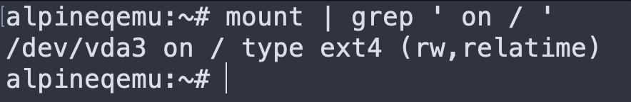

## Результат задания 1

- QEMU и `virt-install` установлены и проверены;
- VM `alpine-qemu` создана с `--virt-type qemu`;
- Alpine Linux установлена на виртуальный диск;
- после перезапуска VM успешно загружается;
- корневая файловая система подтверждена на `/dev/vda3`.

---

# Задание 2 - KVM и libvirt

## Цель

Установить и проверить KVM/libvirt, создать виртуальную машину через `virt-install` с обязательным параметром `--virt-type kvm`, установить гостевую ОС и подтвердить успешную загрузку установленной системы.

Для сопоставимости с заданием 1 сохранены те же основные параметры VM: Alpine Linux 3.13, 1 vCPU, 1024 МБ RAM, диск 4 ГБ `virtio`, serial console `ttyS0`.

## 1. Проверка аппаратной виртуализации и KVM

В Ubuntu проверены флаг аппаратной виртуализации Intel, устройство KVM и наличие основных компонентов libvirt/QEMU:

```bash
printf '%s\n' '=== CPU virtualization ===' && \
grep -m1 -o 'vmx' /proc/cpuinfo && \
printf '%s\n' '=== KVM device ===' && \
ls -l /dev/kvm && \
printf '%s\n' '=== KVM/libvirt packages ===' && \
dpkg -l qemu-kvm libvirt-daemon-system libvirt-clients 2>/dev/null | grep '^ii'
```

Подтверждены `vmx` и наличие `/dev/kvm`. Команда `dpkg -l` показала установленные пакеты `libvirt-daemon-system` и `libvirt-clients`, при этом отдельная строка `qemu-kvm` в выводе отсутствовала. При последующей проверке через `sudo apt install qemu-kvm` Ubuntu 24.04 сообщила, что вместо него используется пакет `qemu-system-x86`, который уже установлен. Поэтому отсутствие отдельного пакета `qemu-kvm` в выводе `dpkg -l` не означало отсутствие QEMU/KVM-компонентов.

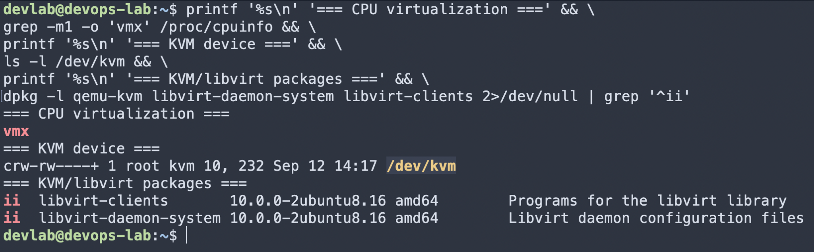

Дополнительно выполнена проверка хоста:

```bash
sudo virt-host-validate qemu
```

Ключевые проверки аппаратной виртуализации и доступа к `/dev/kvm` завершились `PASS`.

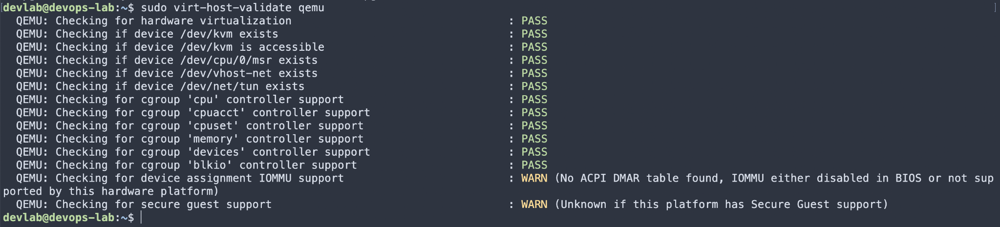

## 2. Создание виртуальной машины KVM

При первоначальном запуске KVM со стандартным CPU-представлением старое 32-битное ядро Alpine 3.13 завершало загрузку с kernel panic. Для совместимости использована более консервативная CPU-модель `qemu64`. Поскольку стенд работает на Intel CPU, из неё исключена AMD-функция `svm`: `--cpu qemu64,-svm`. При этом тип виртуализации остался KVM - `--virt-type kvm`.

Рабочий скрипт `virt-install-alpine-kvm.sh`:

```bash
#!/bin/bash

sudo virt-install \
  --name alpine-kvm \
  --memory 1024 \
  --vcpus 1 \
  --cpu qemu64,-svm \
  --disk size=4,bus=virtio \
  --disk path=/dev/sr0,device=cdrom,readonly=on \
  --location /mnt/alpine-iso,kernel=boot/vmlinuz-lts,initrd=boot/initramfs-lts \
  --extra-args "console=ttyS0,115200" \
  --os-variant alpinelinux3.13 \
  --virt-type kvm \
  --graphics none \
  --console pty,target_type=serial
```

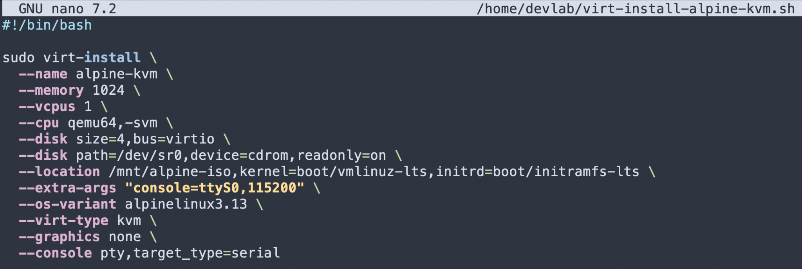

## 3. Загрузка установочной среды через KVM

После корректировки CPU-модели Alpine успешно загрузилась и дошла до serial login prompt:

```text
Welcome to Alpine Linux 3.13
Kernel 5.10.29-0-lts on an i686 (/dev/ttyS0)

localhost login:
```

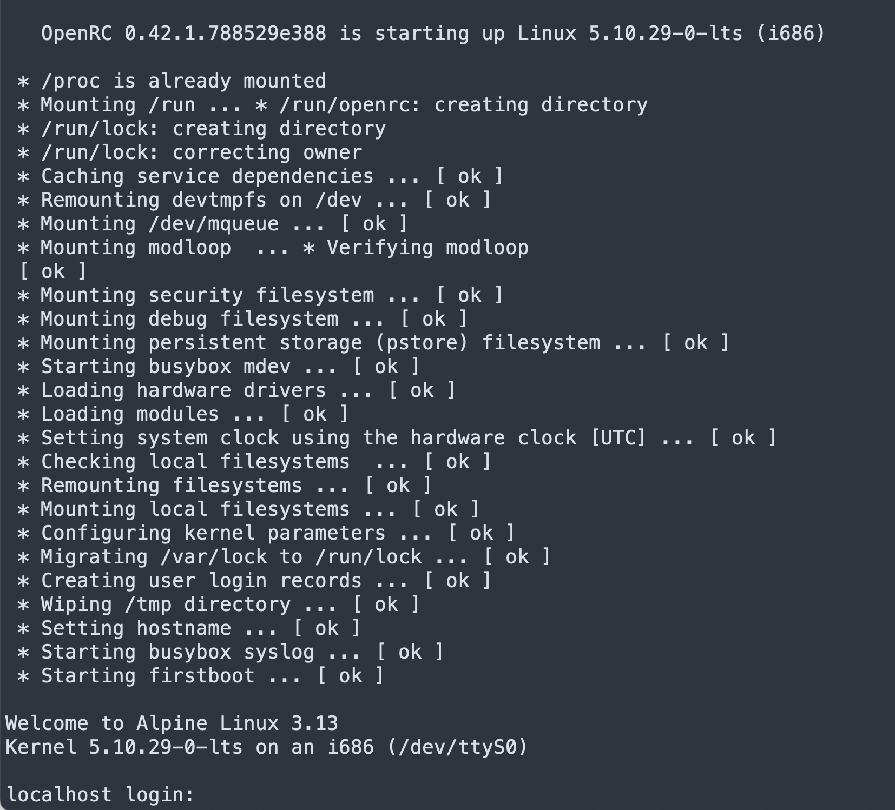

## 4. Установка Alpine на виртуальный диск

Запущен штатный установщик:

```bash
setup-alpine
```

В качестве целевого диска выбран `vda`, режим использования - `sys`.

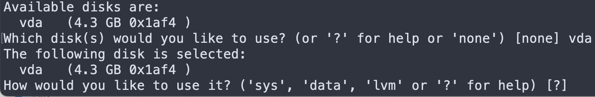

Установка завершилась сообщением:

```text
Installing system on /dev/vda3
/boot is device /dev/vda1
...
Installation is complete. Please reboot.
```

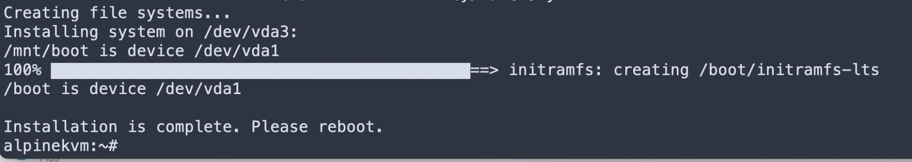

## 5. Проверка загрузки установленной системы

После перезапуска загрузилась уже установленная система с hostname `alpinekvm` и ядром `5.10.152-0-lts`:

```text
Welcome to Alpine Linux 3.13
Kernel 5.10.152-0-lts on an i686 (/dev/ttyS0)

alpinekvm login:
```

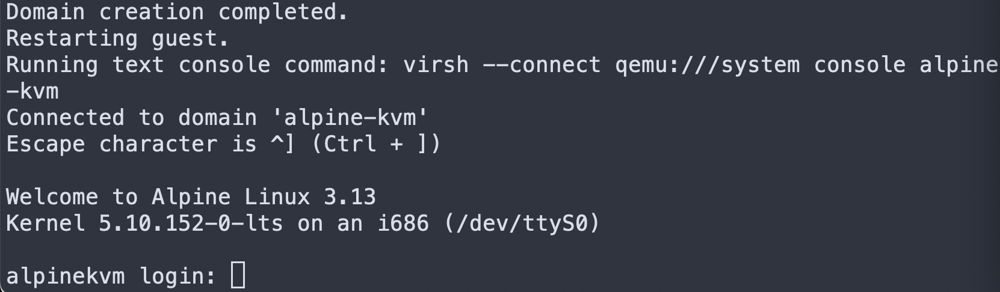

После входа под `root` проверено устройство корневой файловой системы:

```bash
mount | grep ' on / '
```

Результат:

```text
/dev/vda3 on / type ext4 (rw,relatime)
```


## Результат задания 2

- KVM и libvirt установлены и проверены;
- аппаратная виртуализация Intel VT-x доступна внутри Ubuntu;
- VM `alpine-kvm` создана с `--virt-type kvm`;
- для совместимости nested-KVM со старым Alpine использована CPU-модель `qemu64,-svm`;
- Alpine Linux успешно установлена на виртуальный диск;
- установленная система успешно загружается с диска;
- корневая файловая система подтверждена на `/dev/vda3`.

---

# Задание 3 - сравнение QEMU и KVM

## Метод сравнения

Для сравнения времени запуска обе уже установленные VM были приведены к одинаковому исходному состоянию `shut off`. Затем каждая VM запускалась командой `virsh start ... --console`. Время фиксировалось на Ubuntu-хосте непосредственно перед стартом VM и сразу после появления login prompt (приглашения входа в систему).

Основные параметры двух VM были одинаковыми: Alpine Linux 3.13, 1 vCPU, 1024 МБ RAM, 4 ГБ virtio-диск и serial console. Ключевое различие - механизм выполнения CPU:

- QEMU: `--virt-type qemu`;
- KVM: `--virt-type kvm` с CPU-моделью `qemu64,-svm` для совместимости nested Intel KVM.

## 1. Время запуска QEMU

Зафиксировано:

```text
QEMU start: 10:48:00
QEMU login: 10:48:43
```

Наблюдаемое время до login prompt: **43 секунды**.

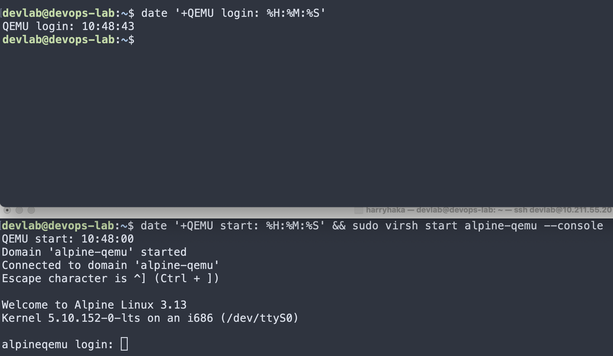

## 2. Время запуска KVM

Зафиксировано:

```text
KVM start: 10:51:28
KVM login: 10:51:39
```

Наблюдаемое время до login prompt: **11 секунд**.

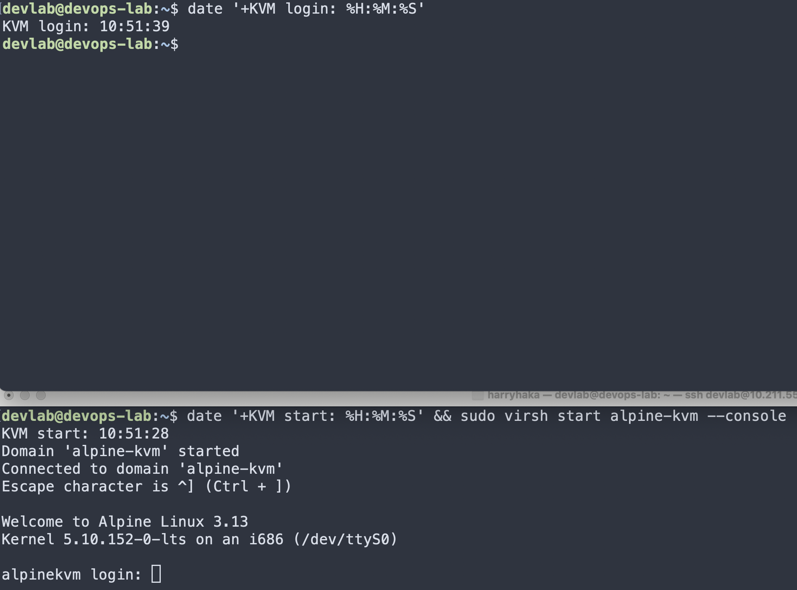

## 3. Сравнение результатов

| Режим | Время до login prompt |
|---|---:|
| QEMU без KVM-ускорения | 43 с |
| KVM | 11 с |

Разница составила 32 секунды. В данном конкретном nested-стенде KVM дошёл до login prompt примерно в **3,9 раза быстрее**, а наблюдаемое время загрузки уменьшилось примерно на **74%**.

При установке Alpine через KVM процесс проходил заметно быстрее, чем при использовании QEMU. Точный замер времени установки отдельно не проводился, поэтому это сравнение основано на наблюдении за ходом установки.

Причина ускорения состоит в том, что в режиме QEMU без KVM выполнение гостевых CPU-инструкций идёт через программный механизм QEMU, тогда как при KVM значительная часть гостевого кода исполняется с аппаратной поддержкой Intel VT-x через `/dev/kvm`.

## Результат задания 3

По результатам отдельного замера времени запуска KVM показала заметно более быструю загрузку виртуальной машины по сравнению с QEMU. При установке Alpine через KVM также наблюдалась более высокая скорость работы.
