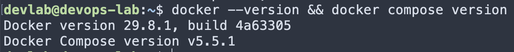
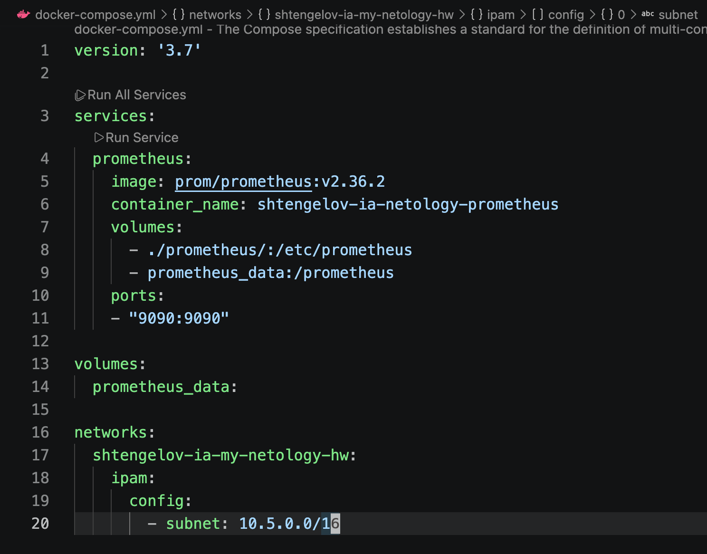
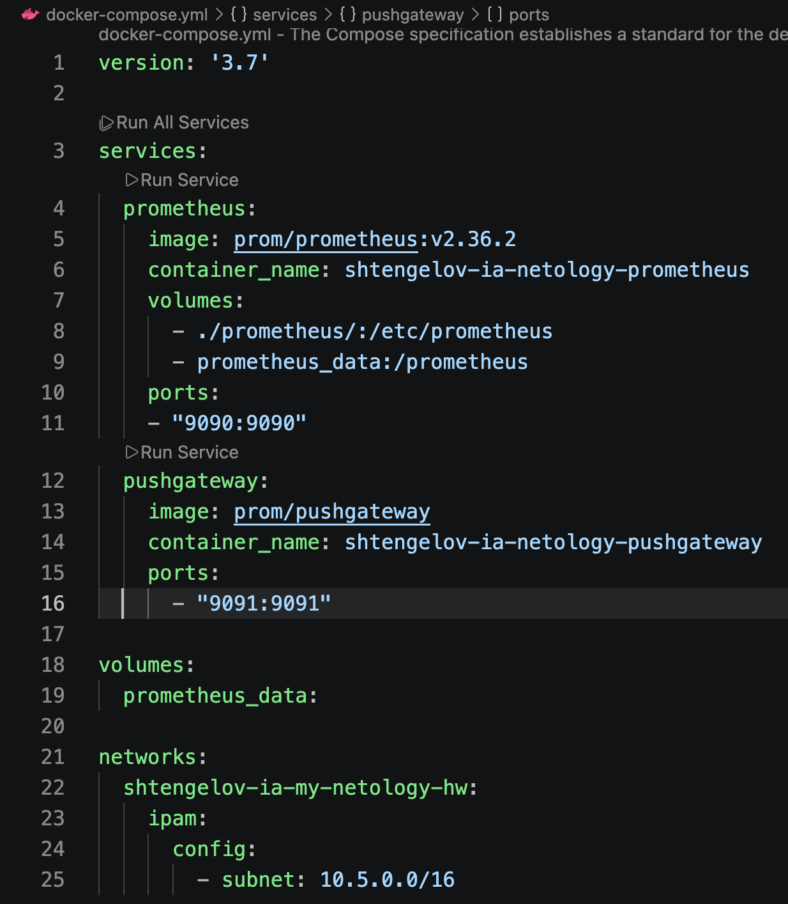
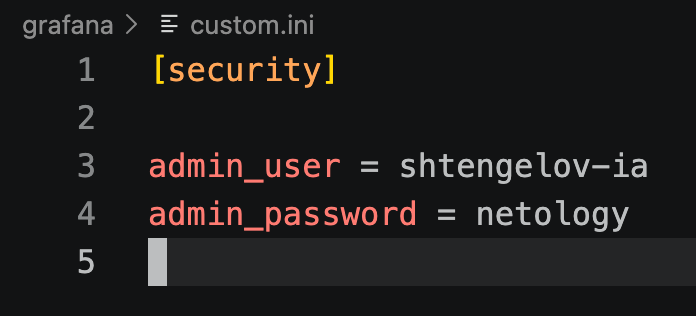
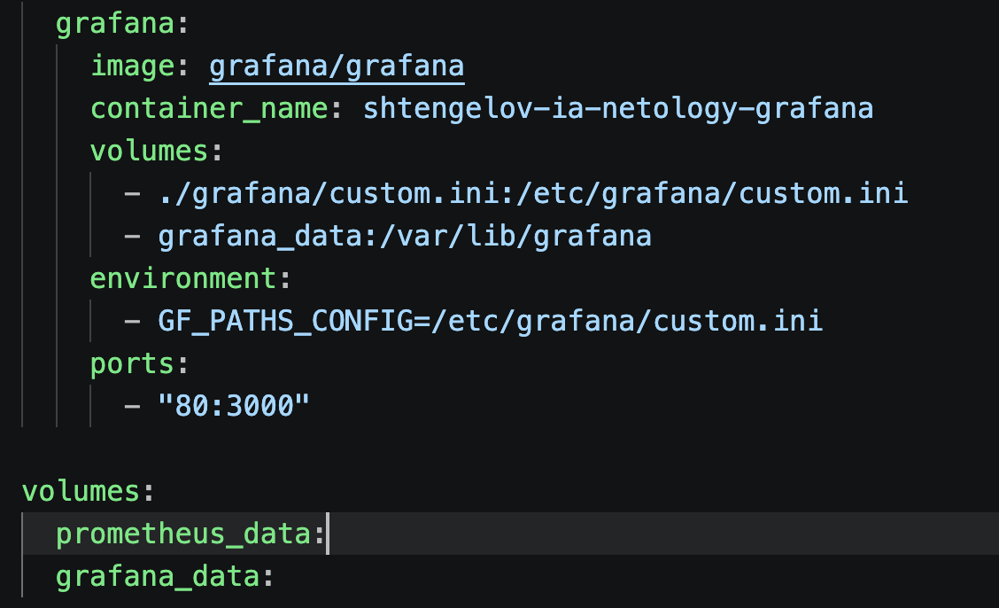
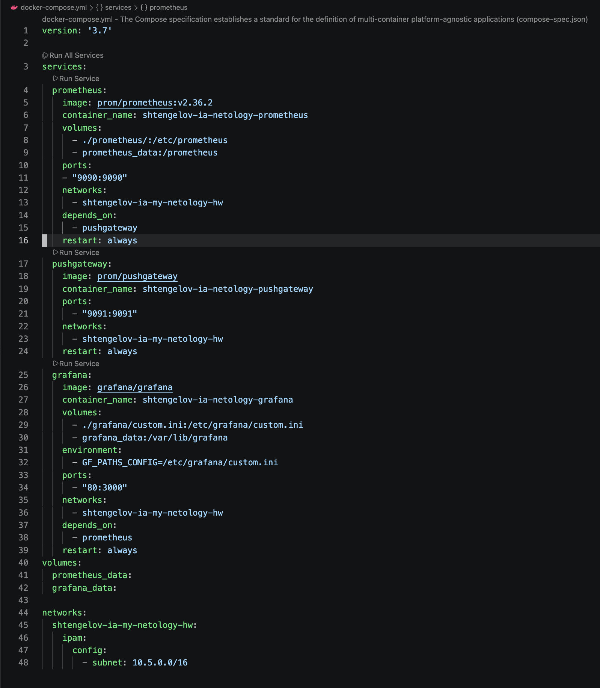
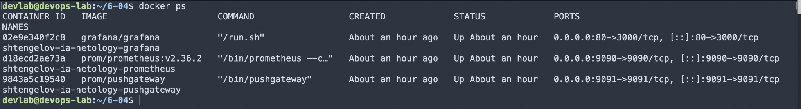
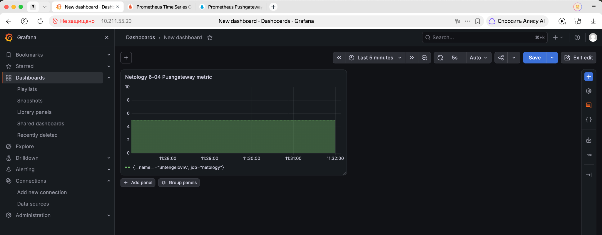
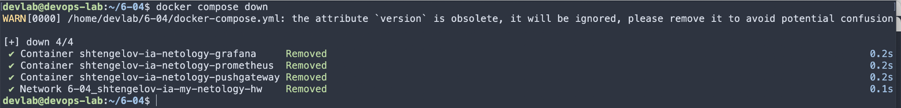

# Домашнее задание «6.4. Docker. Часть 2»

## Оглавление

- [Исходный стенд](#исходный-стенд)
- [Задание 1 - Docker Compose](#задание-1---docker-compose)
- [Задание 2 - первичная конфигурация Compose](#задание-2---первичная-конфигурация-compose)
- [Задание 3 - Prometheus](#задание-3---prometheus)
- [Задание 4 - Pushgateway](#задание-4---pushgateway)
- [Задание 5 - Grafana](#задание-5---grafana)
- [Задание 6 - порядок запуска, restart policy и общая сеть](#задание-6---порядок-запуска-restart-policy-и-общая-сеть)
- [Задание 7 - пользовательская метрика и Grafana](#задание-7---пользовательская-метрика-и-grafana)
- [Задание 8 - остановка и удаление контейнеров](#задание-8---остановка-и-удаление-контейнеров)

---

## Исходный стенд

Работа выполнена в лабораторном контуре:

- Intel Mac -> Parallels Desktop Pro -> Ubuntu Server 24.04.4 LTS x86-64;
- Docker Engine 29.8.1;
- Docker Compose v5.5.1;
- рабочий каталог проекта: `/home/devlab/6-04`;
- IP Ubuntu VM: `10.211.55.20`.

---

# Задание 1 - Docker Compose

Docker Compose нужен для декларативного описания многоконтейнерного приложения в одном YAML-файле: в нём можно задать сервисы, образы, порты, тома, сети, переменные окружения и зависимости, а затем воспроизводимо поднять весь стек одной командой `docker compose up`. Это упрощает учебную и дальнейшую практическую работу: вместо набора отдельных `docker run` команд конфигурацию окружения можно хранить как код, быстро повторно запускать её, переносить на другую машину и более ясно видеть, из каких компонентов состоит приложение.



---

# Задание 2 - первичная конфигурация Compose

## Цель

Создать `docker-compose.yml`, добавить первичные секции `version`, `services`, `volumes`, `networks` и объявить пользовательскую сеть `shtengelov-ia-my-netology-hw` с подсетью `10.5.0.0/16`.

## Конфигурация на этом этапе

```yaml
version: '3.7'

services: {}

volumes: {}

networks:
  shtengelov-ia-my-netology-hw:
    ipam:
      config:
        - subnet: 10.5.0.0/16
```

`ipam` (IP Address Management) задаёт параметры адресного пространства сети. Подсеть `10.5.0.0/16` позволяет Docker автоматически назначать адреса контейнерам внутри созданной сети.

## Результат задания 2

- создан единый файл `docker-compose.yml`;
- подготовлены секции для дальнейшего добавления сервисов и томов;
- объявлена сеть `shtengelov-ia-my-netology-hw`;
- задана подсеть `10.5.0.0/16`.

---

# Задание 3 - Prometheus

## Цель

Добавить в Compose сервис Prometheus, подключить конфигурацию и отдельный том для данных, а также открыть порт `9090`.

## Конфигурация Prometheus

```yaml
prometheus:
  image: prom/prometheus:v2.36.2
  container_name: shtengelov-ia-netology-prometheus
  volumes:
    - ./prometheus/:/etc/prometheus
    - prometheus_data:/prometheus
  ports:
    - "9090:9090"
```

Каталог `./prometheus/` монтируется внутрь контейнера в `/etc/prometheus`, поэтому Prometheus использует подготовленный `prometheus.yml`. Именованный том `prometheus_data` предназначен для хранения данных Prometheus независимо от жизненного цикла контейнера. Публикация `9090:9090` делает веб-интерфейс Prometheus доступным с Docker-сервера.



## Результат задания 3

- добавлен контейнер `shtengelov-ia-netology-prometheus`;
- подключена конфигурация Prometheus;
- добавлен именованный том `prometheus_data`;
- опубликован порт `9090`.

---

# Задание 4 - Pushgateway

## Цель

Добавить Pushgateway с требуемым именем контейнера и обеспечить внешний доступ к порту `9091`.

## Конфигурация Pushgateway

```yaml
pushgateway:
  image: prom/pushgateway
  container_name: shtengelov-ia-netology-pushgateway
  ports:
    - "9091:9091"
```

Имя сервиса оставлено `pushgateway`, потому что оно используется как DNS-имя внутри Docker-сети. В конфигурации Prometheus этот сервис указан как target `pushgateway:9091`.



## Результат задания 4

- добавлен контейнер `shtengelov-ia-netology-pushgateway`;
- опубликован порт `9091`;
- Prometheus может обращаться к Pushgateway по внутреннему имени `pushgateway:9091`.

---

# Задание 5 - Grafana

## Цель

Добавить Grafana, подключить файл `custom.ini` и отдельный том для данных, задать путь к конфигурации через переменную окружения и опубликовать порт контейнера `3000` через порт `80` Docker-сервера.

## 1. Настройка custom.ini

Лекционный файл был изменён только в требуемой части:

```ini
[security]

admin_user = shtengelov-ia
admin_password = netology
```



## 2. Конфигурация Grafana

```yaml
grafana:
  image: grafana/grafana
  container_name: shtengelov-ia-netology-grafana
  volumes:
    - ./grafana/custom.ini:/etc/grafana/custom.ini
    - grafana_data:/var/lib/grafana
  environment:
    - GF_PATHS_CONFIG=/etc/grafana/custom.ini
  ports:
    - "80:3000"
```

`GF_PATHS_CONFIG` указывает Grafana использовать смонтированный файл `/etc/grafana/custom.ini`. Том `grafana_data` сохраняет внутренние данные Grafana. Сопоставление `80:3000` означает: порт `80` Ubuntu VM перенаправляется на порт `3000` контейнера Grafana.



## Результат задания 5

- добавлен контейнер `shtengelov-ia-netology-grafana`;
- настроен пользователь `shtengelov-ia` с паролем `netology`;
- подключён `custom.ini`;
- добавлен том `grafana_data`;
- внешний доступ настроен как `80 -> 3000`.

---

# Задание 6 - порядок запуска, restart policy и общая сеть

## Цель

Настроить последовательность запуска контейнеров, режимы перезапуска, подключение всех сервисов к одной сети и запустить стек в detached-режиме.

## 1. Поочерёдность запуска

В Compose настроена цепочка:

```text
Pushgateway -> Prometheus -> Grafana
```

Для этого использованы зависимости:

```yaml
prometheus:
  depends_on:
    - pushgateway

grafana:
  depends_on:
    - prometheus
```

`depends_on` задаёт порядок запуска контейнеров. В данной конфигурации он не проверяет готовность приложения внутри контейнера, а только обеспечивает запуск зависимого контейнера после указанного сервиса.

## 2. Режим перезапуска

Для всех трёх сервисов добавлено:

```yaml
restart: always
```

Это позволяет Docker автоматически поднимать контейнеры после сбоя процесса или перезапуска Docker daemon.

## 3. Общая сеть

Все сервисы подключены к одной пользовательской сети:

```yaml
networks:
  - shtengelov-ia-my-netology-hw
```

Сама сеть объявлена с подсетью:

```yaml
networks:
  shtengelov-ia-my-netology-hw:
    ipam:
      config:
        - subnet: 10.5.0.0/16
```

## 4. Запуск в detached-режиме

```bash
docker compose up -d
```

`up` создаёт и запускает сервисы из Compose-файла, а `-d` запускает их в фоне.



## Результат задания 6

- порядок запуска: `Pushgateway -> Prometheus -> Grafana`;
- для всех сервисов установлен `restart: always`;
- все контейнеры используют сеть `shtengelov-ia-my-netology-hw`;
- стек запущен командой `docker compose up -d`.

---

# Задание 7 - пользовательская метрика и Grafana

## Цель

Передать собственную метрику со значением `5` через Pushgateway, убедиться, что Prometheus её получает, подключить Prometheus как Data Source в Grafana и построить график по этой метрике.

## 1. Передача метрики в Pushgateway

Выполнена команда:

```bash
echo "ShtengelovIA 5" | curl --data-binary @- http://localhost:9091/metrics/job/netology
```

`echo` формирует строку метрики, а `curl --data-binary @-` передаёт её без изменения формата в Pushgateway. Путь `/metrics/job/netology` добавляет метке значение `job="netology"`.

В Prometheus запрос:

```text
ShtengelovIA
```

вернул метрику со значением `5`:

```text
ShtengelovIA{job="netology"} 5
```

## 2. Data Source Prometheus в Grafana

В Grafana добавлен Data Source Prometheus с адресом:

```text
http://prometheus:9090
```

Использовано внутреннее DNS-имя сервиса `prometheus`, потому что Grafana и Prometheus работают в общей Docker-сети.

## 3. Проверка запущенных контейнеров

```bash
docker ps
```

Команда показывает запущенные контейнеры и опубликованные порты.



На момент проверки работали все три контейнера:

- `shtengelov-ia-netology-prometheus` - порт `9090`;
- `shtengelov-ia-netology-pushgateway` - порт `9091`;
- `shtengelov-ia-netology-grafana` - порт `80 -> 3000`.

## 4. График пользовательской метрики

В Grafana создан график типа Time series по метрике `ShtengelovIA`. На графике отображается значение `5`.



## 5. Итоговый docker-compose.yml

Файл приложен отдельно: [`docker-compose.yml`](docker-compose.yml).

```yaml
version: '3.7'

services:
  prometheus:
    image: prom/prometheus:v2.36.2
    container_name: shtengelov-ia-netology-prometheus
    volumes:
      - ./prometheus/:/etc/prometheus
      - prometheus_data:/prometheus
    ports:
      - "9090:9090"
    networks:
      - shtengelov-ia-my-netology-hw
    depends_on:
      - pushgateway
    restart: always

  pushgateway:
    image: prom/pushgateway
    container_name: shtengelov-ia-netology-pushgateway
    ports:
      - "9091:9091"
    networks:
      - shtengelov-ia-my-netology-hw
    restart: always

  grafana:
    image: grafana/grafana
    container_name: shtengelov-ia-netology-grafana
    volumes:
      - ./grafana/custom.ini:/etc/grafana/custom.ini
      - grafana_data:/var/lib/grafana
    environment:
      - GF_PATHS_CONFIG=/etc/grafana/custom.ini
    ports:
      - "80:3000"
    networks:
      - shtengelov-ia-my-netology-hw
    depends_on:
      - prometheus
    restart: always

volumes:
  prometheus_data:
  grafana_data:

networks:
  shtengelov-ia-my-netology-hw:
    ipam:
      config:
        - subnet: 10.5.0.0/16
```

## Результат задания 7

- метрика `ShtengelovIA` со значением `5` отправлена в Pushgateway;
- Prometheus получил метрику;
- Prometheus подключён в Grafana как Data Source через `http://prometheus:9090`;
- график по пользовательской метрике построен;
- приложены `docker-compose.yml`, `docker ps` и скриншот графика.

---

# Задание 8 - остановка и удаление контейнеров

## Цель

Остановить и удалить все контейнеры Compose-проекта одной командой.

## Выполнение

В каталоге проекта выполнена команда:

```bash
docker compose down
```

`docker compose down` останавливает контейнеры текущего Compose-проекта и удаляет созданные Compose-контейнеры и сеть проекта.

Результат подтвердил удаление:

- `shtengelov-ia-netology-grafana`;
- `shtengelov-ia-netology-prometheus`;
- `shtengelov-ia-netology-pushgateway`;
- сети `6-04_shtengelov-ia-my-netology-hw`.



## Результат задания 8

Все контейнеры домашнего задания остановлены и удалены одной командой `docker compose down`.
